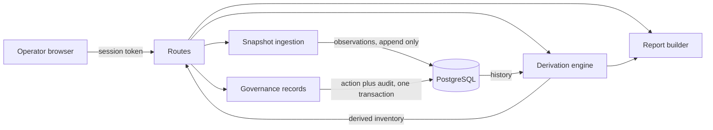

# Application architecture

The version one system: components, data flow, and trust boundaries. This
document describes what Phase 1 builds; the phases beyond it change the
platform underneath the application, not the shape described here. The
working sketches below are for orientation; the finished diagrams are
listed at the end and drawn by hand.

**Contents:** [The idea in plain words](#the-idea-in-plain-words) · [The people using it](#the-people-using-it) · [Components](#components) · [Data flow](#data-flow) · [Trust boundaries](#trust-boundaries) · [The data model shape](#the-data-model-shape) · [The report pipeline](#the-report-pipeline) · [Diagrams to draw](#diagrams-to-draw)

-------------------------------------------------------------------------------

## The idea in plain words

You feed role-call snapshot files: a record of every identity in a cloud
account at one moment. It keeps every snapshot and never edits an old one.
When you open the inventory, it works out each identity's situation on the
spot: compare the newest snapshot with the history, add what humans have
recorded, and show the result. No status is ever stored, so no status can
go stale or be quietly changed; the answer is recomputed from the evidence
every time you ask.

People supply the judgment the files cannot: who owns this identity, which
one is suspicious, which one was reviewed and found fine. Each of those
records is saved with who said it and when, and the same database action
that saves it also writes the audit line, so a decision cannot exist
without its record. Reports and exports come from the same computation the
screen shows, so they cannot disagree with it. And in version one the tool
never connects to the cloud at all: files come in, reports go out, and
nothing else moves.

<!-- vale BuildGuidelines.Audience = NO -->
<!-- Scoped exception: "reviewer" below names the product's user, the
     person who performs an access review, which is the standard term in
     every framework this work follows. It does not describe this
     document's audience, which is what the rule exists to prevent. -->
## The people using it

Four people, and the design answers their questions in their order.

- **The reviewer** certifies identities and groups: what is this, whose is
  it, what can it do and where did that privilege come from, is it used,
  what changed since last time, what do you recommend. Everything on the
  decision screen exists to answer those without leaving the page, and
  when the answer is not there, "insufficient evidence, here is what was
  missing" is a recorded outcome that steers what gets built next.
- **The operator** imports snapshots, runs campaigns, and triages
  findings.
- **The auditor** consumes proof: the population statement, coverage,
  each decision with its actor and time, and remediation followed to
  closure.
- **The administrator** manages users and roles, and nothing else extra.

<!-- vale BuildGuidelines.Audience = YES -->
## Components

| Component | Job |
|---|---|
| Frontend | A single page served by the application; renders every value as text through the document interface with no markup sink, holds the session token in memory rather than browser storage, and runs under a content policy that forbids inline script and style (D-036) |
| Routes | The trust boundary; authentication checked on every request, every response shaped by a declared model |
| Snapshot ingestion | Parses an imported identity snapshot file, bounded on every axis, in memory, append-only |
| Derivation engine | Computes each identity's state and enrichment from the observation history at read time |
| Governance records | The human layer: owners, flags, attestations, written with attribution and an audit row in one transaction |
| Report builder | Produces the self-contained risk report and the escaped CSV and JSON exports |
| PostgreSQL | Holds observations, governance records, and the audit trail; access controlled, with encryption at rest supplied by the deployment layer (D-020) |

## Data flow



An import records observations and touches nothing else. A view derives
the inventory from the history and stores nothing. A governance action is
the only ordinary write besides ingestion, and it commits with its audit
row as one unit. The report builder consumes the same derived inventory
the view does, so a report can never disagree with the screen.

## Trust boundaries

Three boundaries, in order of hostility:

1. **The imported snapshot file.** The only input the application accepts
   from outside, treated as hostile in every particular even though it
   nominally comes from a cloud provider's own reporting: bounded, parsed
   in memory, verified against its own claims, never echoed.
2. **The browser session.** Authenticated on every request; nothing about
   a session is trusted from one request to the next. Identity names,
   tags, and paths inside snapshot data are attacker-influenceable and are
   rendered as text, never markup, because the person most exposed to
   this data is the operator reading it.
3. **The exports.** Everything leaving the system passes an allowlist: the
   response models for the API, formula escaping for the spreadsheet
   forms, and deliberate field selection for the report, because the
   inventory is a map of the account's weakest identities and an export
   is that map on the move.

Version one has no outbound connection to any provider. The cloud
credential and its boundary arrive with the cloud phases and get their own
threat model revision first.

## The data model shape

```
accounts --< snapshots --< observations >-- identities
groups --< group_observations (snapshots also point here)
snapshots --< policy_documents
identities --< governance_records
users, audit_events
```

- An **identity** is one principal in one account, keyed by the account
  plus the provider's immutable identifier, never the name or ARN, which
  are display attributes (D-016). A recreated principal is a new identity.
- A **snapshot** is one imported file: one account at one point in time,
  unique on that pair, so a re-import is rejected rather than
  double-counted.
- An **observation** is the append-only fact that a snapshot saw an
  identity, carrying the attributes seen at that moment: credentials and
  their ages, permission summaries, last-use marks. Groups get their own
  observations, membership and policies per snapshot (D-019), and each
  snapshot stores the managed policy documents it saw in force.
- A **governance record** is the human layer: an owner, a purpose, a flag,
  or an attestation, on an identity or a group (D-019), attributed and
  audited, stored rather than derived because it IS the human input.
<!-- vale BuildGuidelines.Audience = NO -->
- A **review campaign** scopes a set of identities and groups to a set of
  reviewers with a due date (D-021); its items hold each disposition,
  including insufficient evidence, and the campaign closes into an
  evidence export.
<!-- vale BuildGuidelines.Audience = YES -->
- Everything shown about an identity's state, current, stale, unused,
  unowned, over-privileged, is derived by the engine from observations
  plus governance records at read time. No status column exists anywhere.

## The report pipeline

The report is a single self-contained file built from the derived
inventory: no external resources, openable from a disk years later. Risk
ordering comes from the derivation engine, not the report layer, so the
report, the view, and the exports can never rank the same account three
ways. The CSV and JSON exports carry the same fields with spreadsheet
formula escaping applied to every cell that could carry one.

## The route surface

The complete surface, stated so it can be counted. A test asserts this
block against the application's actual route table, so this list and
the API cannot silently disagree; the health routes and the page shell
are public, and every other route answers to the role matrix.

```routes
GET /
GET /health
GET /health/database
POST /auth/login
GET /auth/me
POST /auth/logout
GET /admin/users
POST /admin/users
POST /imports/credential-report
POST /imports/authorization-details
GET /imports
GET /identities
GET /identities/{identity_id}
GET /groups
POST /identities/{identity_id}/governance
POST /groups/{group_id}/governance
POST /identities/{identity_id}/attest
POST /groups/{group_id}/attest
DELETE /governance/{record_id}
POST /campaigns
GET /campaigns
GET /campaigns/rollup
GET /campaigns/{campaign_id}
POST /campaigns/{campaign_id}/items/{item_id}/disposition
POST /campaigns/{campaign_id}/close
GET /export.csv
GET /export.json
GET /report.html
GET /campaigns/{campaign_id}/evidence
```

## Diagrams to draw

Working sketches exist for six so far (the system context, the data
flow, the trust ladder, the phase journey, the subphase cycle, and
the pipeline), as sketch-suffixed files in the diagrams directory, with the rest sketched as the design work needs them. The
finished diagrams below are all still to be drawn by hand, and they
replace the sketches as they complete.

1. **System context.** Operator, application, database, imported files,
   exports out. The one-glance picture.
2. **Data flow.** The mermaid sketch above, drawn properly: import, derive,
   govern, report.
3. **Trust boundaries.** The three boundaries with the controls at each.
4. **The data model.** The tables and their relationships.
5. **Ingestion sequence.** A file's path from upload through bounds,
   verification, observation rows, and the single commit.
6. **Derivation concept.** How observations plus governance records become
   the state on screen, the diagram that explains the no-status-column
   decision.
7. **Governance swimlane.** Operator, owner, and administrator across the
   recertification flow, because cross-role handoffs are what swimlanes
   show best.
8. **The trust ladder.** The phased trust model as layers: read-only
   observation, then report-only quarantine, then human-triggered
   reversible action, then temporary approved re-elevation. The product's
   story in one picture.
9. **Campaign lifecycle.** A review cycle from creation through its item
   dispositions to close and evidence export, the noun D-021 added.
10. **The phase journey.** The eight phases on a timeline with the
    current position marked.
11. **The subphase cycle.** The loop every build subphase travels, with
    human review as the gate.
