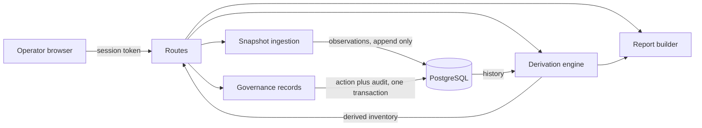

# Application architecture

The version one system: components, data flow, and trust boundaries. This
document describes what Phase 1 builds; the phases beyond it change the
platform underneath the application, not the shape described here. The
working sketches below are for orientation; the finished diagrams are
listed at the end and drawn by hand.

**Contents:** [Components](#components) · [Data flow](#data-flow) · [Trust boundaries](#trust-boundaries) · [The data model shape](#the-data-model-shape) · [The report pipeline](#the-report-pipeline) · [Diagrams to draw](#diagrams-to-draw)

-------------------------------------------------------------------------------

## Components

| Component | Job |
|---|---|
| Frontend | A single page served by the application; renders every value as text, holds the session token in memory |
| Routes | The trust boundary; authentication checked on every request, every response shaped by a declared model |
| Snapshot ingestion | Parses an imported identity snapshot file, bounded on every axis, in memory, append-only |
| Derivation engine | Computes each identity's state and enrichment from the observation history at read time |
| Governance records | The human layer: owners, flags, attestations, written with attribution and an audit row in one transaction |
| Report builder | Produces the self-contained risk report and the escaped CSV and JSON exports |
| PostgreSQL | Holds observations, governance records, and the audit trail; sensitive values encrypted at rest |

## Data flow



An import records observations and touches nothing else. A view derives
the inventory from the history and stores nothing. A governance action is
the only ordinary write besides ingestion, and it commits with its audit
row as one unit. The report builder consumes the same derived inventory
the view does, so a report can never disagree with the screen.

## Trust boundaries

Three boundaries, in order of hostility:

1. **The imported snapshot file.** The only input the application accepts
   from outside, treated as hostile in every particular even though it
   nominally comes from a cloud provider's own reporting: bounded, parsed
   in memory, verified against its own claims, never echoed.
2. **The browser session.** Authenticated on every request; nothing about
   a session is trusted from one request to the next. Identity names,
   tags, and paths inside snapshot data are attacker-influenceable and are
   rendered as text, never markup, because the person most exposed to
   this data is the operator reading it.
3. **The exports.** Everything leaving the system passes an allowlist: the
   response models for the API, formula escaping for the spreadsheet
   forms, and deliberate field selection for the report, because the
   inventory is a map of the account's weakest identities and an export
   is that map on the move.

Version one has no outbound connection to any provider. The cloud
credential and its boundary arrive with the cloud phases and get their own
threat model revision first.

## The data model shape

```
accounts --< snapshots --< observations >-- identities
identities --< governance_records
users, audit_log
```

- An **identity** is one principal in one account, unique on that pair.
- A **snapshot** is one imported file: one account at one point in time,
  unique on that pair, so a re-import is rejected rather than
  double-counted.
- An **observation** is the append-only fact that a snapshot saw an
  identity, carrying the attributes seen at that moment: credentials and
  their ages, permission summaries, last-use marks.
- A **governance record** is the human layer: an owner assignment, a flag,
  or an attestation, attributed and audited, stored rather than derived
  because it IS the human input.
- Everything shown about an identity's state, current, stale, unused,
  unowned, over-privileged, is derived by the engine from observations
  plus governance records at read time. No status column exists anywhere.

## The report pipeline

The report is a single self-contained file built from the derived
inventory: no external resources, openable from a disk years later. Risk
ordering comes from the derivation engine, not the report layer, so the
report, the view, and the exports can never rank the same account three
ways. The CSV and JSON exports carry the same fields with spreadsheet
formula escaping applied to every cell that could carry one.

## Diagrams to draw

Working sketches exist above; these are the finished diagrams, drawn by
hand, added to a diagrams directory as they complete.

1. **System context.** Operator, application, database, imported files,
   exports out. The one-glance picture.
2. **Data flow.** The mermaid sketch above, drawn properly: import, derive,
   govern, report.
3. **Trust boundaries.** The three boundaries with the controls at each.
4. **The data model.** The five tables and their relationships.
5. **Ingestion sequence.** A file's path from upload through bounds,
   verification, observation rows, and the single commit.
6. **Derivation concept.** How observations plus governance records become
   the state on screen, the diagram that explains the no-status-column
   decision.
