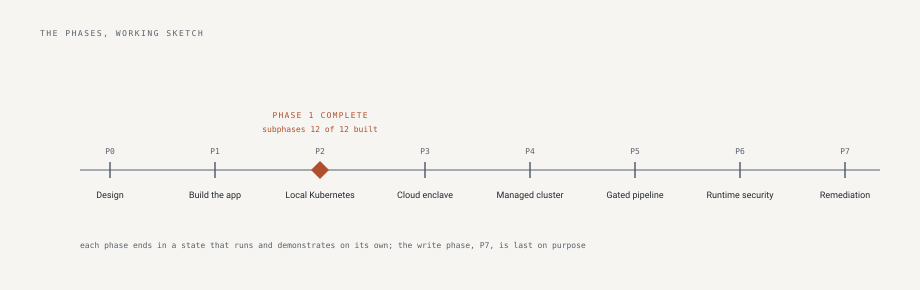

# role-call

An inventory and governance tool for non-human identities: the roles,
service accounts, and access keys that get created, granted permissions
once, and forgotten. They outnumber the humans in most cloud accounts,
and nobody offboards them.

role-call imports identity snapshots, derives each identity's state
from the observed history rather than storing a status that can drift,
and gives each identity what a human needs before acting: an owner,
when it was last used, how old its credentials are, how much privilege
it holds and where that privilege comes from, and whether a governed
name has been quietly recreated. Review campaigns turn that record
into decisions, one item at a time, with the evidence beside each one.
It starts with Amazon Web Services (AWS) identity.

The operating principle is that people decide and the machine never
does. The engine recommends and always names its reasons; automation
prepares, schedules, and verifies; it does not grant, revoke, or
certify on its own judgment, and every action traces to the person who
decided it.

## Contents

- [Status](#status)
- [Setup and run](#setup-and-run)
- [Operating it](#operating-it)
- [The gates a request passes](#the-gates-a-request-passes)
- [Using the app](#using-the-app)
- [What version one does](#what-version-one-does)
- [Repository map](#repository-map)
- [Verified, in numbers](#verified-in-numbers)
- [Compliance traceability](#compliance-traceability)
- [The container is part of the attack surface](#the-container-is-part-of-the-attack-surface)
- [Roadmap](#roadmap)
- [Out of scope](#out-of-scope)
- [How it is built](#how-it-is-built)
- [What done means here](#what-done-means-here)
- [Where to read next](#where-to-read-next)
- [Acknowledgements](#acknowledgements)
- [License](#license)

-------------------------------------------------------------------------------

## Status

**Phase 1 of 8 is complete, subphases 12 of 12 built** and merged,
in a review-gated order fixed before any code
([the plan](#how-phase-1-was-built-the-plan-fixed-before-code)),
closed August 19, 2026. Phase 2, local Kubernetes, has not
begun. A fresh clone with Docker starts the stack, migrates the schema,
serves sign-in with three roles behind a tested authorization matrix,
imports identity snapshots append-only, derives the inventory with its
credential and privilege findings, carries governance records and
review campaigns, and produces the risk report and the escaped
exports. This figure is kept honest by a pipeline check against the
journey diagram (D-031), so it cannot drift from the source.

This is a learning project, built in public, by one person. The
software is provided as is under the
[Apache 2.0 license](LICENSE). Before relying on any of it, read the
code and the [threat model](THREAT-MODEL.md), including its accepted
risks. Nothing here is production software until the documents say so.

-------------------------------------------------------------------------------

## Setup and run

Requires Docker with the compose plugin, and nothing else.

```
cp .env.example .env
# set POSTGRES_PASSWORD, and set ROLECALL_ADMIN_USERNAME and
# ROLECALL_ADMIN_PASSWORD so startup creates your administrator
docker compose up --build
```

Three deliberate behaviors sit behind that block. The compose file
refuses to start while a key is missing, because the tempting
alternative, a hardcoded default, becomes the production secret the
day someone forgets to set the real one; failing at startup is loud
where a default is silent. The application migrates its schema before
it serves, and a failed migration stops the container rather than
letting it answer against a schema it does not understand. And the
image build installs the dependency tree by cryptographic hash, so a
package that differs from the reviewed one, from any source, for any
reason, fails to install instead of running.

Open http://127.0.0.1:8000 and sign in with the administrator from
your .env. No password or secret is written anywhere in this
repository; you create all of them locally.

Then import the sample account that ships in
[sample-data](sample-data): three snapshot generations, both file
formats, the capture time in each file's name. Import them oldest
first from the Imports view, because state is derived from history and
the history should arrive in the order it happened; then read the
inventory.

The sample account is synthetic and deterministic, generated by
`python -m rolecall.sample_data`, and it is built to trigger every
finding the engine can produce, including the ones that need history:
an identity that stops being used, a group that gains a member, and a
name that comes back under a new identifier. It is generated rather
than typed because hand-typed demo data was wrong three times in three
subphases before this became a rule; a test regenerates it and fails
if the shipped files and the generator disagree.

To stop, `docker compose down`; add `-v` to also delete the database
and start clean. Backup, restore, and retention are in
[Operating it](#operating-it), next.

-------------------------------------------------------------------------------

## Operating it

Each procedure below was run against a live stack before it was
written down.

**Backup.** The database is the only state; the containers hold
nothing worth keeping. One command produces a dated, compressed dump:

```
docker compose exec -T db pg_dump -U rolecall -Fc rolecall > rolecall-$(date +%Y-%m-%d).dump
```

The dump contains every snapshot, observation, governance record,
campaign, and audit row. It contains password hashes and session token
hashes but no passwords and no tokens, because none are ever stored.
Store it where the database's readers are the only readers: the
observations inside it name every identity in the connected accounts,
which is reconnaissance material in the wrong hands.

**Restore.** Restore replaces the running database. Stop the
application first so nothing writes mid-restore:

```
docker compose stop app
docker compose exec -T db pg_restore -U rolecall --clean --if-exists -d rolecall < rolecall-2026-08-19.dump
docker compose start app
```

The application migrates on start, so a dump taken by an older schema
is brought forward automatically, and a failed migration stops the
container rather than serving the wrong schema.

**Verify the backup.** A backup that was never restored is a hope.
Restore into a throwaway database and count:

```
docker compose exec -T db createdb -U rolecall restore_drill
docker compose exec -T db pg_restore -U rolecall -d restore_drill < rolecall-2026-08-19.dump
docker compose exec -T db psql -U rolecall -d restore_drill -c "select count(*) from observations"
docker compose exec -T db dropdb -U rolecall restore_drill
```

The count matches the live table or the backup is not a backup.

**Retention.** The record model is append-only by design:
observations, governance history, campaign decisions, and audit rows
exist to answer questions years later, so the data itself has no
deletion schedule inside the application. Retention is therefore a
property of the backups: keep daily dumps for thirty days and one
dump per month for two years, deleting older ones, which bounds disk
while preserving the ability to answer how any decision looked at the
time it was made. An instance holding a real organization's data
follows that organization's records schedule where it is stricter.

**The clean-slate reset**, development only, deletes every imported
snapshot, every governance record, and the audit history:

```
docker compose down -v
docker compose up --build
```

-------------------------------------------------------------------------------

## The gates a request passes

Three parts, with all security enforced in the middle one: a
PostgreSQL database reachable only by the application container, the
FastAPI backend where every rule lives, and one HTML page that holds
no security logic on purpose, because a browser page is fully under
its user's control and anything enforced there is decoration.

Every request to the backend passes the same gates in order, and each
gate exists because of a specific failure:

- **Session check.** Who is calling. The session token is an opaque
  random value, and the database stores only its SHA-256 digest, a
  one-way fingerprint: someone who reads the table holds nothing they
  can replay. Sessions are individually revocable and expire
  absolutely, because expiry without revocation means one stolen
  token can only be ended by logging everyone out, which in practice
  means nobody does it.
- **Two different refusals.** A missing or dead session gets 401, a
  valid session without the needed role gets 403 naming the roles
  that would be admitted. An authenticated caller deserves an answer
  they can act on, and separating no identity from insufficient
  authority costs an attacker nothing they could not learn anyway.
- **The role matrix.** May this role call this route. One data
  structure in [rolecall/roles.py](rolecall/roles.py) is the single
  answer: the route dependencies read it to enforce and the tests
  read it to verify, so the enforced matrix and the tested matrix
  cannot drift apart. A route missing from the matrix fails the
  build, and a typo in a matrix key crashes the process at startup
  rather than leaving a route unguarded.
- **Typed validation.** Is the request sane. Every body passes a
  typed model with bounds, and a rejected value is never echoed back,
  because an error message that repeats attacker input is a
  reflection surface wearing a helpful face.
- **The action, through the ORM.** The object-relational mapper, the
  library that turns Python objects into parameterized database
  queries, is the only path to the database, which removes SQL
  injection, attacker text becoming database commands, as a class
  rather than defending it query by query.
- **The audit row, in the same transaction.** Any action that changes
  governance state commits together with its audit record, so neither
  can exist without the other. A best-effort trail was rejected
  because the gap between action and record is exactly where an
  investigation dies.
- **The response, through a declared model.** What a client may see
  is defined by schema, not by what the row happens to contain, so an
  internal field added next year does not leak by default.

In classic terms the gates implement authentication, authorization,
and accounting; the design principle is that each is a mechanism that
runs, not a rule that hopes.

Sign-in itself gets four defenses of its own. Passwords hash with
bcrypt, which salts automatically and is deliberately slow by an
adjustable work factor, turning a bulk password-cracking run from
hours into years. An unknown username pays the same bcrypt cost and
receives the identical response body as a wrong password, so neither
timing nor wording reveals which accounts exist. Failed attempts are
rate limited per username and per address, counting failures only,
with no account lockout, because a lockout hands any attacker who can
spell a username a denial of service against its owner. And the
attempted password never reaches a log; the log line records that a
failure happened, not what was typed.

-------------------------------------------------------------------------------

<!-- vale BuildGuidelines.Audience = NO -->
<!-- Scoped exception: "reviewer" below names the product's role, the
     person who performs an access review inside the application. It
     does not describe this document's audience. -->

## Using the app

Three roles. A reviewer reads everything and records attestations and
review decisions. An operator additionally imports snapshots and sets
governance: owners, purposes, flags. An administrator additionally
manages the application's local users.

**Imports.** The two AWS export formats, the credential report and the
authorization details file, are parsed in memory, bounded on every
axis, and never written to disk. The file's content is authoritative
and its name is not, because a filename is client input; a file
claiming to cover one account is verified to cover one account rather
than trusted; a timestamp with an unrecognized timezone is rejected
rather than guessed, because capture times order the history and
therefore decide what counts as current. Imports are append-only and
duplicates are rejected, so a re-import is harmless and out-of-order
syncs self-correct.

**Inventory.** The dashboard counts identities by their worst finding
tier; the table filters by name, type, and tier. Nothing here is a
stored status: every figure is computed at read time from the
observation history, because a stored security status that drifts
from reality is worse than none, people trust it. The computation
runs against the newest snapshot's capture time, never the wall
clock, so a month-old import shows month-old staleness honestly, and
the as-of line states what the page knows. Hiding an identity from
this inventory requires tampering with the stored history again after
every future sync, because each sync is a full snapshot and state is
re-derived from all of it.

**Identity detail.** The observation timeline, the findings, and the
governance section. Identities are keyed by the provider's immutable
identifier, not by name, so a principal deleted and recreated under
its old name is a new identity that inherits nothing, and the reuse
of a governed name is itself surfaced, because inheriting a dead
identity's standing is exactly how a recreated principal would be
laundered. An identity is not flaggable as unused until it has been
observed for fourteen days, because a two-week-old key that has not
been used yet is new, not stale, and the false positive that cries
wolf on day one costs the tool its credibility.

Findings explain themselves and name their sources: which policy,
held directly or through which group. Privilege is judged by what a
policy can do, not what it is called, so a policy named ReadOnly that
grants the permission to attach arbitrary policies is reported as the
administrator it is. Escalation detection covers the published
single-permission and permission-pair paths a principal could use to
raise its own privilege, and reports them for principals nobody calls
an administrator, because the shadow admin is the finding that
matters; the actual administrators are already on somebody's list.

The governance section holds the human record: a typed owner, a
purpose, flags, and attestations, each attributed, each superseded or
cleared rather than edited, so the history of who said what stands
the way the machine history does. The owner is a team by default,
because an individual owner is the orphan in waiting: the person
leaves, nothing in the cloud account changes, and the identity keeps
its keys with nobody accountable, which is the failure class this
tool opens with. Assigning an owner answers the unowned finding; a
disagreement between the assigned owner and the provider's tag is
surfaced as its own notice naming both values, because a silent
winner would hide exactly the staleness a governance tool exists to
show.

**Groups.** Privilege sources with members, owners, and their own
findings. An empty privileged group is reported before anyone joins
it, because it is a standing grant waiting for its next member with
nobody reviewing it today. What changed since the previous snapshot,
who joined and who left, is computed and shown, because the delta is
what a review actually reviews; re-reading the full list every
quarter is how rubber-stamping happens.

**Campaigns.** A campaign freezes its scope into items at creation,
each item carrying the evidence as it stood and the engine's
recommendation with its reasons, so the review covers a stated
population rather than a moving one; the population statement in the
evidence export describes that frozen set, which is what makes it a
statement instead of a target. Decisions are one item, one person:
certify, revoke recommended, insufficient evidence, or delegated.
There is no bulk certification anywhere in the application, because a
certification records that someone looked at that identity, and a
button that certifies a hundred rows at once records that nobody did.
Insufficient evidence must name what was missing and delegation must
name who holds it now, because those answers are meaningless without
their notes; the rollup collects the missing-evidence notes across
campaigns, since one recurring note is a reviewer's problem and the
same note across a column is the program's problem. A decision is
final within its campaign, a changed mind being the next campaign's
decision, and close refuses while any item is unanswered, because an
access review with gaps is a false population statement. The evidence
export carries the population statement, coverage, and every decision
with actor and time.

**Reports.** The risk report is one self-contained file ranked by the
engine, safe to open from disk years later. Because it opens from
disk, no server header protects it, so it is rendered by an engine
that escapes every value by default and contains no script element at
all. The CSV prefixes every formula-leading cell, because a cell that
begins with an equals sign executes in the reader's spreadsheet with
the reader's permissions, and identity names are controlled by the
observed account's users. The JSON export carries the same figures the
page shows, raw, because JSON consumers parse rather than interpret.
All three read from the one computation the page reads.

**The page itself** renders every API value through its text
interface, never as markup, so a hostile identity name displays as a
string instead of running as script; a parser-based scan of the page's
code fails the build if a markup sink appears. The session token lives
in a closure variable rather than browser storage, where any script
that ever ran in the page could read it; the accepted cost is that a
refresh signs you out. The content policy forbids inline script and
style, and the page needs neither.

<!-- vale BuildGuidelines.Audience = YES -->

-------------------------------------------------------------------------------

## What version one does

Four operations, and nothing else:

- An operator authenticates, into one of three roles.
- An identity snapshot file is imported, recorded append-only, with
  synthetic sample data shipped so a stranger with only Docker can run
  the demo.
- The operator views the enriched inventory and produces the
  self-contained risk report plus CSV and JSON exports.
- The operator governs in role-call only: owners, purposes, flags,
  attestations, and review campaigns. Nothing is written to the cloud
  account.

That set exercises authentication, authorization across three roles,
input validation, derived state, audit logging, and the enrichment
model, and it keeps the tool's own cloud credential read-only. Adding
more operations would not add a property that is not already
demonstrated.

-------------------------------------------------------------------------------

## Repository map

| Path | Role |
|---|---|
| `rolecall/main.py` | Application assembly: routes, security headers, the static shell |
| `rolecall/roles.py` | The role matrix, single source: who may call what |
| `rolecall/deps.py` | Authentication, authorization, and the write budget, as dependencies |
| `rolecall/ingest/` | The two snapshot parsers: bounded, in memory, distrusting their own preconditions |
| `rolecall/models.py` | The tables; append-only observation history as structure |
| `rolecall/derive.py` | State from history at read time; the freshest value per field |
| `rolecall/findings.py` | Credential findings, each explaining itself with its OWASP anchor |
| `rolecall/policy_analysis.py` | What a policy document grants, read by capability |
| `rolecall/privilege.py` | The privilege picture with source attribution; shadow admin detection |
| `rolecall/governance.py` | The human layer: typed owners, purposes, flags, attestations |
| `rolecall/campaigns.py` | Recommendations with reasons, and the delta since last certification |
| `rolecall/assessment.py` | The one computation the page, the campaigns, and the exports all read |
| `rolecall/reports.py` | The ranked report and the escaped exports |
| `rolecall/routes/` | The route handlers, every one in the matrix or named public |
| `rolecall/audit.py` | The audit spine: the record commits with the action |
| `rolecall/sample_data.py` | The deterministic sample account generator |
| `frontend/` | One page, no build step; every value rendered as text |
| `migrations/` | The schema from the first table |
| `sample-data/` | The generated demo account, committed and checked |
| `tests/` | The attack checklist; the matrix walked row by row |
| `scripts/` | The gates: docs-truth, digest parity, the mutation check |
| `diagrams/` | Working sketches, including the journey diagram the status reads from |
| `requirements*.in` / `*.txt` | Chosen packages, and the hash-pinned trees that install |
| `Dockerfile` / `docker-compose.yml` | Digest-pinned base, non-root user, the composed stack |
| `.github/workflows/` | The pipeline: tests, types, scanners, the container jobs |
| `.pre-commit-config.yaml` | Secret scan, writing rules, and the truth gates at commit time |
| `.env.example` | Documents required configuration without containing it |

-------------------------------------------------------------------------------

## Verified, in numbers

The figures below are the repository's own, each checkable by the
command or test named beside it.

**128 tests in 20 files**, each named for the property it defends. The
load-bearing ones:

- `test_matrix.py`: every one of the **29 routes** is either in the
  role matrix or explicitly public, the documented route enumeration
  in ARCHITECTURE.md matches the live route table in both directions,
  and every matrix row is exercised with a real session per role,
  allow and refuse both asserted.
- `test_ingest.py`, `test_ingest_authz.py`, and two Hypothesis
  property suites: hostile, truncated, and mixed-account files are
  rejected whole; nothing the caller sent is echoed back.
- `test_findings.py` and `test_privilege.py`: the **19 finding
  codes**, each carrying its OWASP Non-Human Identities anchor;
  admin equivalence judged by capability, not name.
- `test_governance.py`: set, supersede, clear, and attest, attributed
  and audited; an assigned owner answers the unowned finding; a
  disagreement with the tag is surfaced.
- `test_campaigns.py`: the population freezes, a decision is final
  within its campaign, notes are required where meaning needs them,
  close refuses gaps, the delta reads what changed.
- `test_reports.py`: formula cells arrive neutralized, hostile markup
  arrives escaped, report figures equal engine figures.
- `test_frontend.py`: the page has no markup sink, no inline script,
  and a hostile name survives as data end to end.
- `test_auth.py` and `test_ratelimit.py`: indistinguishable login
  failures, revocation, expiry, a forged token refused beside a live
  session, and the write budget holding.

**Coverage is 94 percent, floored at 90 in the pipeline.** The floor
sits under the measured figure to catch erosion without inviting tests
written to move a number.

**Seven mutations, seven kills.** The mutation check breaks one
control at a time and requires the tests that claim that control to
fail:

| Mutation | Result |
|---|---|
| Authorization check removed | killed by the matrix tests |
| Audit rows silently dropped | killed by the governance tests |
| Token hashing broken to a constant | killed, by a test this check forced into existence |
| Rate limiter always allows | killed by the limiter tests |
| Formula escaping removed from the CSV exit | killed by the report tests |
| Assigned owners no longer answer the unowned finding | killed by the governance tests |
| Campaigns close with undecided items | killed by the campaign tests |

On its first run the third mutation survived: every test presented a
real token or none, so a constant hash matched any fabricated token
and nothing noticed. The missing test exists now, which is the check
doing exactly what it is for.

**42 recorded decisions, 6 migrations, 8 required checks.** Every
merge to main passes secret scanning, writing rules and status-truth
gates, workflow lint and audit, link checks, the application job with
the coverage floor and mutation check, two static analysis passes, and
the container job.

-------------------------------------------------------------------------------

<!-- vale BuildGuidelines.Audience = NO -->
<!-- Scoped exception: "reviewer" below names the product's user, the
     person who performs an access review, which is the standard term in
     every framework this work follows. It does not describe this
     document's audience. -->

## Compliance traceability

The published frameworks that codify what this tool does, mapped in
both directions: from each requirement to what answers it, and from
each design decision to the requirements that informed it. Wordings
are paraphrased; exact clause text is verified against the current
edition before anything claims conformance.

| Requirement | What it asks | What answers it here |
|---|---|---|
| PCI DSS 4.0, 7.2.4 | Review all user accounts and privileges at least every six months | Review campaigns with due dates and recurrence presets, and the per-campaign evidence export with population and coverage (D-021, D-039); tests/test_campaigns.py and tests/test_reports.py hold them |
| PCI DSS 4.0, 7.2.5 and 7.2.5.1 | Application and system accounts get least privilege and periodic review at a risk-based frequency | The non-human inventory with privilege findings attributed to their source, and campaign recurrence, all present |
| OWASP Non-Human Identities Top 10 (2025) | The named risk classes for non-human identities | Every finding carries its NHI identifier as the anchor field, from improper offboarding through human use of a non-human identity |
| NIST SP 800-53, AC-2 | Accounts managed, reviewed on a schedule, disabled when inactive | The inventory, staleness findings on a minimum observation age, and scheduled campaigns; disabling waits for the action phases by design (D-005) |
| NIST SP 800-53, AC-6(7) | Periodic review of privileges, with removal when no longer fit | Privilege findings with source attribution, and the revoke-recommended disposition carrying its reasons into the evidence export |
| ISO/IEC 27002:2022, 5.16 | Identity lifecycle management, explicitly including non-human | The whole product |
| ISO/IEC 27002:2022, 5.18 | Access rights reviewed at planned intervals and on change | Campaigns with the delta-since-last-certification view, so the review reads what changed rather than re-reading everything |
| CIS Controls v8, 5.1 and 5.5 | An inventory of accounts, and a dedicated, validated service account inventory | The inventory, derived from snapshots, with the as-of statement on every view |
| CIS Controls v8, 5.3 | Dormant accounts disabled after a defined period | Staleness findings with the minimum observation age; action itself deferred (D-005) |
| SOX ITGC and SOC 2 CC6 practice | Complete population, independent reviewer, evidence per decision, timely remediation | The frozen population statement, attribution on every decision, the evidence export, and a close that refuses gaps, all present |

| Decision | Framework grounding |
|---|---|
| D-005 enrichment over automation | AC-2 and CIS 5.3 name disabling as the goal; this design routes it through a human until the trust ladder earns the action phases |
| D-006 append-only derived state | The SOX completeness and evidence expectations: a population and history that cannot silently change |
| D-016 immutable identifier keying | OWASP NHI reuse risk: a recreated principal must not inherit standing |
| D-019 identities act, sources grant, both governed | ISO 5.18 and universal access review practice certify group memberships, so the group must hold owners and attestations |
| D-021 the review campaign scope | PCI 7.2.4 and 7.2.5, ISO 5.18, AC-2, and audit practice all define the periodic, evidenced review as the unit of governance |
<!-- vale BuildGuidelines.Audience = YES -->

-------------------------------------------------------------------------------

## The container is part of the attack surface

Least privilege applies to the container boundary, not only to code
(D-042). Both services run with a read-only root filesystem, no
privilege escalation route, bounded memory and processor use, and the
database publishes no host port: only the application container can
reach it. The application drops every Linux capability, because
serving HTTP as an unprivileged user needs none; the database drops
everything and adds back only the five its entrypoint uses to take
ownership of a fresh volume. Writable paths are in-memory filesystems,
so nothing written by an attacker survives a restart.

Every claim above is verifiable against the running stack:

```bash
docker compose exec app id                                  # uid=1000(rolecall), not root
docker compose exec app sh -c "echo x > /srv/rolecall/probe"  # fails: read-only file system
docker compose exec app sh -c "grep CapEff /proc/1/status"  # all zeros
docker inspect role-call-db-1 --format '{{.HostConfig.PortBindings}}'  # map[]
```

The image itself is built from a digest-pinned base, linted in the
pipeline, and the base's operating system packages are scanned on
every pull request, blocking on critical findings that have fixes,
because there the fix is moving the digest, which a pull request can
do.

-------------------------------------------------------------------------------

## Roadmap

The destination is a tool where every non-human identity is governed
the way human accounts already are: a named owner, a stated purpose, a
privilege picture beside its actual usage, a next review date, and
evidence behind every one of those claims, so the identity nobody can
explain becomes visible the day it appears rather than the day it is
abused.



**Phase 0, design.** Architecture, data flow, trust boundaries, the
threat model, the confirmed scope, the diagram list. No code.

**Phase 1, build the application.** The smallest system that genuinely
governs identities, with the controls present from the first commit:
authentication on every request, three roles checked per route, rate
limits and a request budget, audit rows in the acting transaction,
migrations from the first table, hash-pinned dependencies, a
digest-pinned base image, and exports that cannot carry spreadsheet
formulas. Locally the stack speaks plain HTTP on the loopback
interface; transport encryption is the edge's job and arrives with the
cloud phases.


### How Phase 1 was built: the plan, fixed before code

Phase 1 was divided into twelve ordered subphases, planned in full in
advance and built one at a time. A subphase is built in small commits
on its own branch and then stops: a human reads the diff, runs the
demo, and reads the tests, and only after that review is the pull
request merged with the required checks green, so the merge itself is
the public record of the review. No approval is required on the pull
request, because there is no second person to give one and a
self-approval would be theater; the gates are the checks and the
deliberate merge. There is no testing phase at the end, because every
subphase ships its own tests, and no hardening phase in substance,
because each control arrives with the thing it protects; the final
subphase is proof, not retrofit.


1. **Foundation.** Hash-pinned dependencies checked against canonical
   sources, the software bill of materials, automated update review, a
   digest-pinned container image, fail-fast configuration, migrations
   from the first table, allowlist logging, health.
2. **Operators.** Sign-in with a timing-equal path for unknown names,
   revocable sessions, the three roles checked per route, the audit
   spine writing in the same transaction as every action.
3. **Ingestion one.** The credential report parser: bounded, in
   memory, verified against its own claims, append-only, identities
   keyed by the provider's immutable identifier, with its
   property-based fuzz suite.
4. **Ingestion two.** The authorization details parser: roles, trust
   policies, groups as privilege sources, memberships, policy
   documents, tags, and recreated-name detection.
5. **Derivation and credential findings.** State from history at read
   time, and the credential-hygiene findings with their tiers and the
   minimum observation age.
6. **Privilege findings.** Admin equivalence by capability, escalation
   paths, external trust exposure, ownership and group findings,
   membership drift, privilege attributed to its source.
7. **Sample data.** The synthetic generator producing both file
   formats across three snapshot generations and every archetype the
   rules need; moved up from eleventh with the reason recorded in
   D-034, because every subphase since the first parser had needed
   demo input made by hand, and hand-made input was wrong three times.
8. **Inventory and frontend.** The lists, the detail view with its
   observation timeline, the dashboard, the as-of banner, and the
   single page that renders every value as text.
9. **Governance records.** Owner, purpose, flag, and attestation on
   identities and groups, attributed, audited, clearable.
10. **Review campaigns.** Scoped, deadlined review cycles with
    per-item dispositions including insufficient evidence,
    recommendations with their reasons, the change-since-last-
    certification view, and no bulk certification by design.
11. **Reports and exports.** Escaped CSV and JSON, the self-contained
    risk report, and the per-campaign evidence export with its
    population statement.
12. **Proof, and the stranger drill.** Container hardening verified by
    command, the mutation check with coverage measured to inform it,
    the external checklist audits, figures verified against the
    running system, the fresh-clone run on a machine with nothing but
    Docker, and the documents re-read and shortened.

The order had reasons. Identity before data, because every later route
needs the role checks. Parsers before the engine, because reading the
data before designing against it is the deepest lesson this project
inherits. Credential findings before privilege findings, because the
second carries the judgment and gets the hardest review. The frontend
in the middle, so every later subphase demonstrates with clicks.
Governance before campaigns, because the noun precedes the workflow.
Sample data before the frontend, so demonstrations run against
realistic data instead of input typed by hand. The plan bound the
order, not the learning: a discovery mid-build became a decision, an
amendment, or a backlog entry, visibly, so the difference between the
plan as written and the build as it happened stays readable in
[DECISIONS.md](DECISIONS.md).

**Phase 2, local Kubernetes.** The image orchestrated on kind with
Calico, so network policies are enforced rather than silently ignored;
role-based access control, pod security standards, admission control.

**Phase 3, cloud enclave as code.** The AWS environment as code, split
into persistent foundation and ephemeral workload. The organization
trail lands here, which is also when enrichment deepens: creator
attribution and usage beyond the provider's 90 day window become
possible only with logs to hold them.

**Phase 4, managed Kubernetes.** The image promoted by digest into the
enclave; the orchestration questions were already answered locally.

**Phase 5, security-gated pipeline.** The running gates consolidated,
the gaps closed, and the set proven by introducing a flaw deliberately
and confirming the pipeline stops it.

**Phase 6, runtime security and alerting.** Detection on the audit
events the threat model names, alerts on new high-risk identities, and
the first-hour response procedure written and exercised once.

**Phase 7, human-triggered remediation.** The trust step change:
a tightly scoped action credential, deactivate and restore behind
step-up authentication, each action shown as a policy diff before it
happens and verified against the provider afterward, because clicked
is not revoked until the provider says so. Report-only quarantine and
review windows arrive here, and this phase requires its own threat
model revision before any code, because write access changes what the
tool is.

Beyond the phases, in order: expected-profile checks, where a known
vendor integration holding exactly its documented permissions is
furniture and the same integration holding more is a finding;
temporary approved re-elevation, where someone else approves and the
clock does the offboarding; and more providers, Okta and Entra, as
adapters behind the same append-only ingestion rather than rewrites.

Each phase ends in a state that runs and demonstrates on its own, with
the diagrams updated, the decisions recorded, and the documents
re-read and shortened.

-------------------------------------------------------------------------------

## Out of scope

Recorded so each absence is a decision rather than an oversight.

- **No writes to the cloud account until Phase 7.** Enrichment over
  automation: the tool never holds a credential more powerful than its
  current phase needs.
- **One provider.** AWS first; building two providers before one is
  governed well would add breadth without adding a property.
- **Effective privilege through role chaining is not computed.**
  Version one scores what a policy grants, not what assume-role chains
  can reach, and says so on the page. Reachability is real graph work
  that earns its own phase.
- **No automated remediation, ever, by design.** A tool that revokes
  on its own gets disabled the first time it breaks something.
- **No live provider connection in version one.** Files first, because
  the fresh-clone demo must run with Docker alone; the read-only pull
  joins in the cloud phases behind the same ingestion.
- **No real-time event stream in version one.** Snapshots are
  imported; event-driven refresh arrives with the cloud phases.

-------------------------------------------------------------------------------

## How it is built

The build is review-gated on purpose: the
[plan above](#how-phase-1-was-built-the-plan-fixed-before-code) fixed
the subphases and their order before any code, every change lands
through a pull request whose checks include the writing rules and the
status-truth gates, and [AI-USAGE.md](AI-USAGE.md) keeps the record of
what the coding agent got wrong along the way, because that record is
the point.

The pipeline runs the suite with the coverage floor, strict typing,
the mutation check, secret scanning in three layers, dependency audits
against the hash-pinned trees, static analysis, workflow lint and
audit, container lint, the base image scan, and link and writing
checks across these documents. Each tool was vetted at adoption and
recorded as a decision, and two of them found real defects here before
they were merged.

Dependencies are the part of the codebase nobody here wrote, so each
one was checked against its canonical source before adoption, and
installs are hash-pinned: a substituted artifact fails to install
instead of running.

| Package | Canonical source | Role |
|---|---|---|
| fastapi | github.com/fastapi/fastapi | web framework; typed validation as the default path |
| uvicorn | github.com/Kludex/uvicorn | application server |
| SQLAlchemy | sqlalchemy.org | the ORM; parameterization removes injection as a class |
| psycopg | github.com/psycopg/psycopg | PostgreSQL driver |
| alembic | github.com/sqlalchemy/alembic | schema migrations from the first table |
| bcrypt | github.com/pyca/bcrypt | password hashing, used directly, maintained by the Python Cryptographic Authority |
| pydantic-settings | github.com/pydantic/pydantic-settings | fail-fast configuration |
| python-multipart | github.com/Kludex/python-multipart | upload parsing for the two import routes |
| jinja2 | github.com/pallets/jinja | the report engine, escaping by default (D-040) |

The development tree (pytest, Hypothesis, ruff, mypy, pip-audit,
pytest-cov, pip-tools) is verified the same way and isolated in its
own hash-pinned file.

-------------------------------------------------------------------------------

## What done means here

Done is a claim, so it carries a definition. For this build:

**Done means a stranger can run it, and every decision can be
defended.**

- It runs from a fresh clone using only this document and Docker, and
  that drill was performed, not assumed.
- Every control is a mechanism with a test named beside it, the
  container claims are verifiable by the commands printed above, and
  the mutation check proves the tests would notice the controls
  breaking.
- Every figure a document states is asserted against the running
  system or gated against its source, so the documents cannot quietly
  disagree with the code.
- Every non-obvious choice carries its reason and its rejected
  alternative in [DECISIONS.md](DECISIONS.md), including what was
  deliberately left out.
- No credential-shaped string exists anywhere in the repository or its
  history, including demo and test material.

Done does not mean finished: the roadmap above and the out-of-scope
list are the record of what is deliberately absent, each with its
reason, because an undocumented gap and a considered exclusion look
identical in code.

-------------------------------------------------------------------------------

## Where to read next

- [ARCHITECTURE.md](ARCHITECTURE.md) is the components, the data flow,
  the trust boundaries, the route surface a test asserts, and the
  diagram list.
- [THREAT-MODEL.md](THREAT-MODEL.md) is the ranked threats, each
  mapped to its control, and the accepted risks.
- [DECISIONS.md](DECISIONS.md) records what was chosen, what was
  rejected, and why, D-001 through D-042.
- [SECURITY.md](SECURITY.md) is the reporting path and the controls
  tables, each control with the test that proves it.
- [AGENTS.md](AGENTS.md) is the standards this project is built to.

-------------------------------------------------------------------------------

## Acknowledgements

The ideas here were learned from projects and publications that came
first. Ideas are free to take; taking them namelessly is not how this
project works. Where a lesson was taken, the source is named; where a
gap remains, the documents say so.

- **[Repokid](https://github.com/Netflix/repokid)** (Netflix). Finding
  unused permissions is easy and removing them safely is the product;
  its staged, reversible removal shapes the action phases, and its
  eligibility idea became the minimum observation age.
- **[Cloudsplaining](https://github.com/salesforce/cloudsplaining)**
  (Salesforce). The single-file, risk-prioritized report as the
  artifact people actually share.
- **[PMapper](https://github.com/nccgroup/PMapper)** (NCC Group). The
  demonstration that reach through assume-role chains exceeds what
  policies say directly; version one states that limitation plainly as
  a debt to PMapper's argument.
- **[Cartography](https://github.com/lyft/cartography)** (Lyft).
  Identity relationships as a graph with a common model across
  sources, the shape later providers join through.
- **[ConsoleMe](https://github.com/Netflix/consoleme)** (Netflix).
  Ownership and request workflows as what turns an inventory into
  governance.
- **Rhino Security Labs' privilege escalation research** (2018). The
  published catalogue of permission combinations that let a principal
  raise its own privilege; the escalation heuristics detect the
  combinations it named.
- **[SkyArk](https://github.com/cyberark/SkyArk)** (CyberArk). Shadow
  admin detection: privilege judged by what a policy can do, not what
  it is called.
- **[Prowler](https://github.com/prowler-cloud/prowler)** and the
  credential report tradition, the check taxonomy the findings
  vocabulary builds on.
- **[Aardvark](https://github.com/Netflix-Skunkworks/aardvark)**
  (Netflix, archived). The adapter lesson: consume the provider's
  native successor rather than maintaining a scraper.
- **[diagram-design](https://github.com/cathrynlavery/diagram-design)**
  (Cathryn Lavery, MIT). The working sketches follow drawing
  principles adapted from its editorial doctrine: the complexity
  budget, restraint with emphasis, and the rule that a diagram is done
  when nothing can be removed.
- **[OWASP](https://owasp.org/)**, whose lists shaped the design well
  beyond the one the findings anchor to: the Non-Human Identities Top
  10 (2025) supplies the finding identifiers, and the Web Application,
  API Security, CI/CD Security, Kubernetes, Docker, and LLM
  Applications lists were each walked item by item against the design,
  several controls existing because that walk caught their absence.
- **PCI DSS 4.0, ISO/IEC 27002:2022, NIST SP 800-53, CIS Controls
  v8**, and the audit practice around SOX and SOC 2, which together
  define the periodic, evidenced access review this tool serves; the
  two-way mapping is in [Compliance traceability](#compliance-traceability).
- **Andrew Koenig** and the AntiPatterns authors, whose two-part test
  disciplines how this project writes down what not to do.

Nothing here claims novelty for its parts. The parts are assembled
from the projects above, the standards named, and lessons from earlier
builds; what this project adds is the combination, the governance loop
as open source, and the record of how it was built.

-------------------------------------------------------------------------------

## License

[Apache 2.0](LICENSE). The software is provided as is; read the code
and the [threat model](THREAT-MODEL.md) before relying on it.
