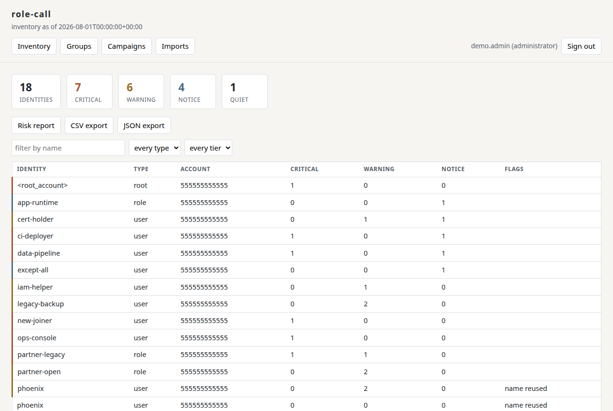
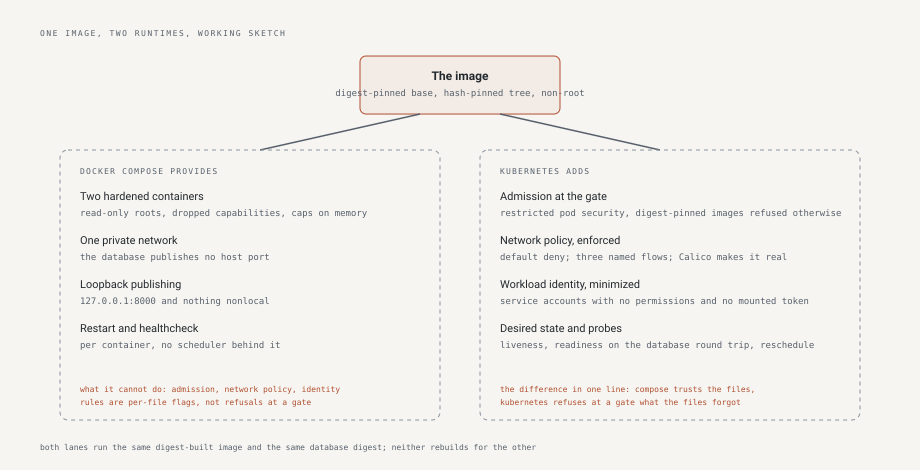
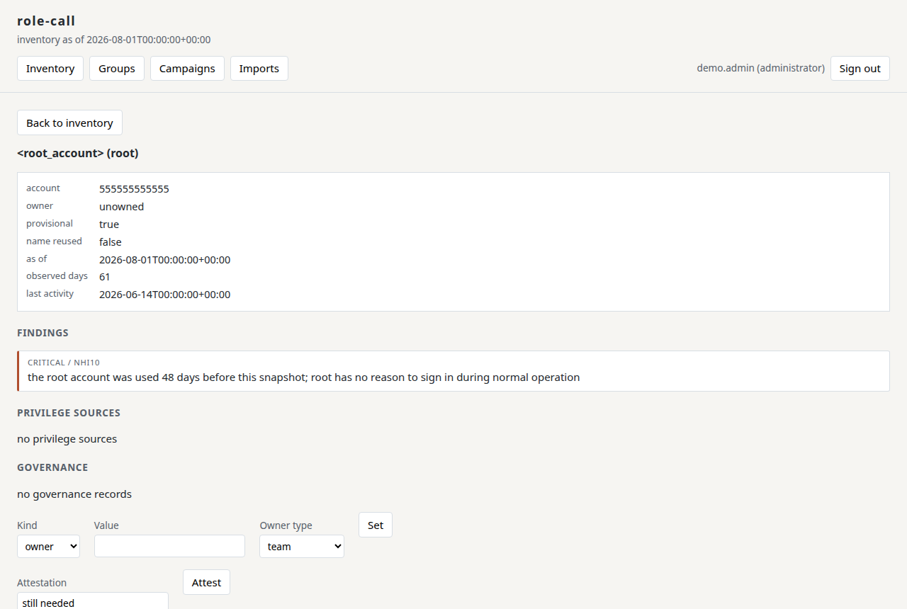
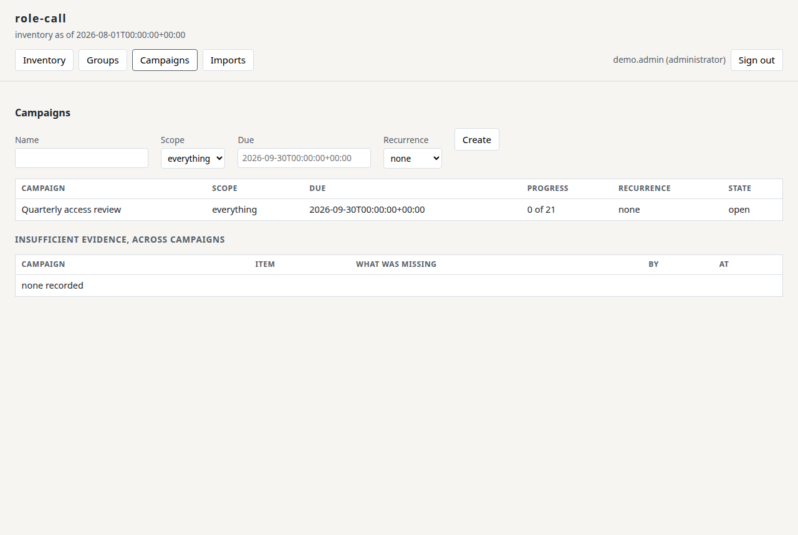
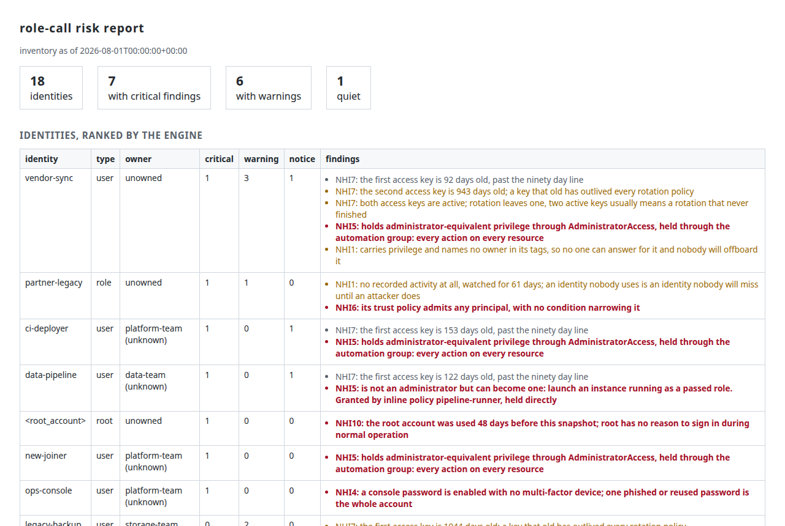
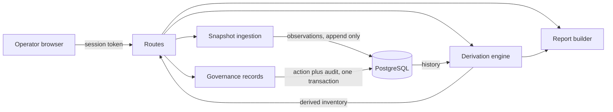
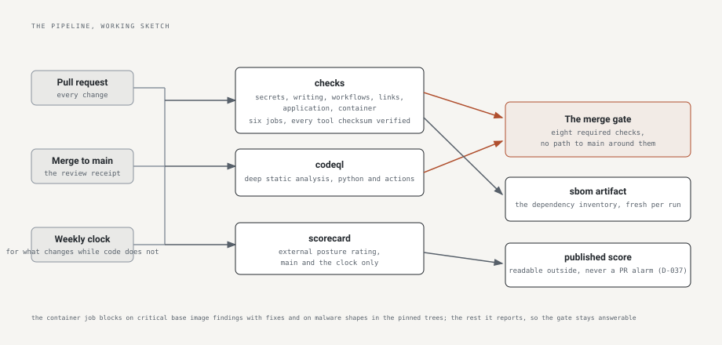
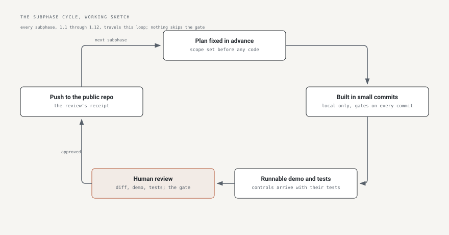

# role-call

An inventory and governance tool for non-human identities: the roles,
service accounts, and access keys that get created, granted permissions
once, and forgotten. They outnumber the humans in most cloud accounts,
and nobody offboards them.

role-call imports identity snapshots, derives each identity's state
from the observed history rather than storing a status that can drift,
and gives each identity what a human needs before acting: an owner,
when it was last used, how old its credentials are, how much privilege
it holds and where that privilege comes from, and whether a governed
name has been quietly recreated. Review campaigns turn that record
into decisions, one item at a time, with the evidence beside each one.
It starts with Amazon Web Services (AWS) identity.

The operating principle is that people decide and the machine never
does. The engine recommends and always names its reasons; automation
prepares, schedules, and verifies; it does not grant, revoke, or
certify on its own judgment, and every action traces to the person who
decided it.

**The measured figures, each counted by a test:**

| Measured | Standing |
|---|---|
| Tests | **139 tests in 21 files**, coverage 94 over a 90 percent floor |
| Mutation | 7 controls removed by the check, 7 noticed by the suite |
| Surface | **30 routes**, every one in the role matrix the tests walk |
| Record | **52 recorded decisions**, each with its rejected alternatives |
| Gates | 8 required checks on every merge; releases carry provenance attestations |

The commands behind every figure are in
[The numbers, proven](#the-numbers-proven); a figure that drifts from
its count fails the build.



**Quick start**, with Docker as the only requirement:

```bash
git clone https://github.com/tltaylor1/role-call.git && cd role-call
cp .env.example .env   # fill in the four values it names
docker compose up -d
```

Then open http://127.0.0.1:8000 and import the shipped sample account;
[Run it](#run-it) has the full path and the reasons behind each step.

## Contents

- [Status](#status)
- [The problem](#the-problem)
- [What this is](#what-this-is)
- [Run it](#run-it)
- [Running it on Kubernetes](#running-it-on-kubernetes)
- [Using it](#using-it)
- [How a request is protected](#how-a-request-is-protected)
- [What runs where](#what-runs-where)
- [How it is put together](#how-it-is-put-together)
- [What it defends against](#what-it-defends-against)
- [Compliance traceability](#compliance-traceability)
- [Operating it](#operating-it)
- [How it was built and gated](#how-it-was-built-and-gated)
- [The numbers, proven](#the-numbers-proven)
- [What comes next, and what never will](#what-comes-next-and-what-never-will)
- [What done means here](#what-done-means-here)
- [Contributing](#contributing)
- [Diagrams to draw](#diagrams-to-draw)
- [Where to read next](#where-to-read-next)
- [Acknowledgements](#acknowledgements)
- [License](#license)

-------------------------------------------------------------------------------

## Status

[](https://scorecard.dev/viewer/?uri=github.com/tltaylor1/role-call)

**Phases 1 and 2 of 8 are complete and tagged v0.2.0**, with build
provenance attestations on every release artifact. Phase 1 built the
application in twelve review-gated subphases whose order was fixed
before any code ([the plan](#the-plan-fixed-before-code)): a fresh
clone with Docker starts the stack, migrates the schema, serves
sign-in with three roles behind a tested authorization matrix,
imports identity snapshots append-only, derives the inventory with
its credential and privilege findings, carries governance records and
review campaigns, and produces the risk report and the escaped
exports. Phase 2 put the same digest-built image on a hardened local
Kubernetes cluster: default-deny network policies with three named
flows, the restricted pod security standard, an admission policy
refusing unpinned images, and workload identities with nothing to
steal; every claim has its probe in
[Running it on Kubernetes](#running-it-on-kubernetes). Phase
transitions are human declarations, recorded when made. The platform
journey continues in the [program](https://tltaylor1.github.io).

This is a learning project, built in public, by one person. The
software is provided as is under the
[Apache 2.0 license](LICENSE). Before relying on any of it, read the
code and the [threat model](#what-it-defends-against), including its
accepted risks. Nothing here is production software until the
documents say so.

-------------------------------------------------------------------------------

## The problem

Non-human identities outnumber the humans in most cloud accounts:
service accounts created for one integration, roles granted broad
policies to make something work, access keys minted for a script
whose author has left. Human accounts get onboarding, review, and
offboarding; these get created, granted, and forgotten. The tools
that do track them tend to store a status column somebody set once,
and a stored status drifts the day after it is written.

The result is the identity nobody can explain: privileged, unused,
unowned, and invisible until the day it is abused. That identity is
what this application exists to surface.

-------------------------------------------------------------------------------

## What this is

You feed role-call snapshot files: a record of every identity in a
cloud account at one moment. It keeps every snapshot and never edits
an old one. When you open the inventory, it works out each identity's
situation on the spot: compare the newest snapshot with the history,
add what humans have recorded, and show the result. No status is ever
stored, so no status can go stale or be quietly changed; the answer is
recomputed from the evidence every time you ask.

People supply what the files cannot: who owns this identity, which one
is suspicious, which one was reviewed and found fine. Each of those
records is saved with who said it and when, and the same database
action that saves it also writes the audit line, so a decision cannot
exist without its record. Reports and exports come from the same
computation the screen shows, so they cannot disagree with it. And in
version one the tool never connects to the cloud at all: files come
in, reports go out, and nothing else moves.

### What version one does

Four operations, and nothing else:

- An operator authenticates, into one of three roles.
- An identity snapshot file is imported, recorded append-only, with
  synthetic sample data shipped so a stranger with only Docker can run
  the demo.
- The operator views the enriched inventory and produces the
  self-contained risk report plus CSV and JSON exports.
- The operator governs in role-call only: owners, purposes, flags,
  attestations, and review campaigns. Nothing is written to the cloud
  account.

That set exercises authentication, authorization across three roles,
input validation, derived state, audit logging, and the enrichment
model, and it keeps the tool's own cloud credential read-only. Adding
more operations would not add a property that is not already
demonstrated.

-------------------------------------------------------------------------------

## Run it

Requires Docker with the compose plugin, and nothing else.

```
cp .env.example .env
# set POSTGRES_PASSWORD, and set ROLECALL_ADMIN_USERNAME and
# ROLECALL_ADMIN_PASSWORD so startup creates your administrator
docker compose up --build
```

Three deliberate behaviors sit behind that block. The compose file
refuses to start while a key is missing, because the tempting
alternative, a hardcoded default, becomes the production secret the
day someone forgets to set the real one; failing at startup is loud
where a default is silent. A separate migration step runs first, as
the database's owner role, and a failed migration stops the start
rather than letting anything serve against a schema it does not
understand; the application's own role holds data rights only
(D-013), so the serving container could not change the schema even
through an injection flaw the ORM has no path for. And the
image build installs the dependency tree by cryptographic hash, so a
package that differs from the reviewed one, from any source, for any
reason, fails to install instead of running.

Open http://127.0.0.1:8000 and sign in with the administrator from
your .env. No password or secret is written anywhere in this
repository; you create all of them locally.

Then import the sample account that ships in
[sample-data](sample-data): three snapshot generations, both file
formats, the capture time in each file's name. Import them oldest
first from the Imports view, because state is derived from history and
the history should arrive in the order it happened; then read the
inventory.

The sample account is synthetic and deterministic, generated by
`python -m rolecall.sample_data`, and it is built to trigger every
finding the engine can produce, including the ones that need history:
an identity that stops being used, a group that gains a member, and a
name that comes back under a new identifier. It is generated rather
than typed because hand-typed demo data was wrong three times in three
subphases before this became a rule; a test regenerates it and fails
if the shipped files and the generator disagree.

The committed account stays small on purpose: one identity per
archetype, so every finding is readable. For load work the same
generator scales: `python -m rolecall.sample_data out --scale 1000`
adds a thousand bulk identities to each generation, one third people
with passwords and two thirds services with keys, every variation
derived from the identity's index so the output is byte-identical on
every run. Scaled sets ship as release artifacts, never as commits.

To stop, `docker compose down`; add `-v` to also delete the database
and start clean. The care of a running instance is in
[Backup, restore, and retention](#operating-it),
next.

-------------------------------------------------------------------------------

## Running it on Kubernetes

The same image, the second runtime. Docker Compose trusts its files;
Kubernetes refuses at a gate what a file forgot, and this deployment
exists to make those refusals real on a laptop before any cloud is
involved.



```
scripts/cluster-up.sh
export POSTGRES_PASSWORD=... ROLECALL_ADMIN_USERNAME=... ROLECALL_ADMIN_PASSWORD=...
scripts/deploy-app.sh
```

The first script fetches kind and kubectl from their canonical
releases, verifies their checksums, and brings up a cluster on a
digest-pinned node image with Calico installed from a vendored,
digest-verified manifest; the default network plugin is disabled
because it ignores network policies silently. The second builds the
image, loads it into the cluster so no registry is ever consulted,
creates the secrets from your environment, refusing to run while one
is missing, and waits for readiness. The page is at
http://127.0.0.1:8000, published on the loopback interface only,
matching the compose posture. `scripts/cluster-down.sh` removes it
all.

What the cluster enforces that compose cannot, each verifiable:

- **Network policy, default deny.** Everything is refused except the
  three flows the system has: operator to application, application to
  database, and name resolution. Calico enforces; the probes prove:

```bash
.tools/kubectl -n rolecall exec deploy/app -- python -c "import socket; socket.create_connection(('db', 5432), timeout=5); print('allowed')"
.tools/kubectl -n rolecall run probe --image=postgres@sha256:18cfe3ef5e6815560c98237d6216d1e5119702fb0f3894c8785dd58b8bbe5d73 --restart=Never --command -- sleep 300
.tools/kubectl -n rolecall exec probe -- timeout 4 bash -c "echo > /dev/tcp/db/5432"   # hangs and dies: denied
```

- **Admission, two layers.** The namespace enforces the restricted Pod
  Security Standard, and a validating admission policy refuses any
  image not pinned by digest, with the locally built application image
  as the one recorded exception (D-047). A privileged pod and an
  unpinned image are both refused at creation, wording and all:

```bash
.tools/kubectl -n rolecall run unpinned --image=nginx:latest --restart=Never   # refused by pod security
```

- **No orchestrator identity to steal.** The workloads run under
  service accounts with no permissions and no mounted token, because
  the application needs nothing from the Kubernetes API:

```bash
.tools/kubectl -n rolecall exec deploy/app -- ls /var/run/secrets/kubernetes.io   # No such file or directory
```

The manifests are schema-validated and posture-linted in the pipeline
by kubeconform and kube-linter, both fetched checksum-verified like
every other tool.

-------------------------------------------------------------------------------

## Using it

The pages, from a running instance with the sample account imported
(captured by [scripts/capture_screenshots.py](scripts/capture_screenshots.py),
so these images are reproducible rather than asserted):







Four people, and the design answers their questions in their order.

- **The reviewer** certifies identities and groups: what is this,
  whose is it, what can it do and where did that privilege come from,
  is it used, what changed since last time, what do you recommend.
  Everything on the decision screen exists to answer those without
  leaving the page, and when the answer is not there, "insufficient
  evidence, here is what was missing" is a recorded outcome that
  steers what gets built next.
- **The operator** imports snapshots, runs campaigns, and triages
  findings.
- **The auditor** consumes proof: the population statement, coverage,
  each decision with its actor and time.
- **The administrator** manages users and roles, and nothing else.

Three roles. A reviewer reads everything and records attestations and
review decisions. An operator additionally imports snapshots and sets
governance: owners, purposes, flags. An administrator additionally
manages the application's local users.

**Imports.** The two AWS export formats, the credential report and the
authorization details file, are parsed in memory, bounded on every
axis, and never written to disk. The file's content is authoritative
and its name is not, because a filename is client input; a file
claiming to cover one account is verified to cover one account rather
than trusted; a timestamp with an unrecognized timezone is rejected
rather than guessed, because capture times order the history and
therefore decide what counts as current. Imports are append-only and
duplicates are rejected, so a re-import is harmless and out-of-order
syncs self-correct.

**Inventory.** The dashboard counts identities by their worst finding
tier; the table filters by name, type, and tier. Nothing here is a
stored status: every figure is computed at read time from the
observation history, because a stored security status that drifts
from reality is worse than none, people trust it. The computation
runs against the newest snapshot's capture time, never the wall
clock, so a month-old import shows month-old staleness rather than
aging by itself, and the as-of line states what the page knows. Hiding an identity from
this inventory requires tampering with the stored history again after
every future sync, because each sync is a full snapshot and state is
re-derived from all of it.

**Identity detail.** The observation timeline, the findings, and the
governance section. Identities are keyed by the provider's immutable
identifier, not by name, so a principal deleted and recreated under
its old name is a new identity that inherits nothing, and the reuse
of a governed name is itself surfaced, because inheriting a dead
identity's standing is exactly how a recreated principal would be
laundered. An identity is not flaggable as unused until it has been
observed for fourteen days, because a two-week-old key that has not
been used yet is new, not stale, and a false positive on day one
costs the tool its credibility.

Findings explain themselves and name their sources: which policy,
held directly or through which group. Privilege is judged by what a
policy can do, not what it is called, so a policy named ReadOnly that
grants the permission to attach arbitrary policies is reported as the
administrator it is. Escalation detection covers the published
single-permission and permission-pair paths a principal could use to
raise its own privilege, and reports them for principals nobody calls
an administrator, because the shadow admin is the finding that
matters; the actual administrators are already on somebody's list.

The governance section holds the human record: a typed owner, a
purpose, flags, and attestations, each attributed, each superseded or
cleared rather than edited, so the history of who said what stands
the way the machine history does. The owner is a team by default,
because an individual owner is the orphan in waiting: the person
leaves, nothing in the cloud account changes, and the identity keeps
its keys with nobody accountable, which is the failure class this
tool opens with. Assigning an owner answers the unowned finding; a
disagreement between the assigned owner and the provider's tag is
surfaced as its own notice naming both values, because a silent
winner would hide exactly the staleness a governance tool exists to
show.

**Groups.** Privilege sources with members, owners, and their own
findings. An empty privileged group is reported before anyone joins
it, because it is a standing grant waiting for its next member with
nobody reviewing it today. What changed since the previous snapshot,
who joined and who left, is computed and shown, because the delta is
what a review actually reviews; re-reading the full list every
quarter produces approval without attention.

**Campaigns.** A campaign freezes its scope into items at creation,
each item carrying the evidence as it stood and the engine's
recommendation with its reasons, so the review covers a stated
population rather than a moving one; the population statement in the
evidence export describes that frozen set, which is what makes it a
statement instead of a target. Decisions are one item, one person:
certify, revoke recommended, insufficient evidence, or delegated.
There is no bulk certification anywhere in the application, because a
certification records that someone looked at that identity, and a
button that certifies a hundred rows at once records that nobody did.
Insufficient evidence must name what was missing and delegation must
name who holds it now, because those answers are meaningless without
their notes; the rollup collects the missing-evidence notes across
campaigns, since one recurring note is a reviewer's problem and the
same note across a column is the program's problem. A decision is
final within its campaign, a changed mind being the next campaign's
decision, and close refuses while any item is unanswered, because an
access review with gaps is a false population statement. The evidence
export carries the population statement, coverage, and every decision
with actor and time.

**Reports.** The risk report is one self-contained file ranked by the
engine, safe to open from disk years later. Because it opens from
disk, no server header protects it, so it is rendered by an engine
that escapes every value by default and contains no script element at
all. The CSV prefixes every formula-leading cell, because a cell that
begins with an equals sign executes in the reader's spreadsheet with
the reader's permissions, and identity names are controlled by the
observed account's users. The JSON export carries the same figures the
page shows, raw, because JSON consumers parse rather than interpret.
All three read from the one computation the page reads.

**The page itself** renders every API value through its text
interface, never as markup, so a hostile identity name displays as a
string instead of running as script; a parser-based scan of the page's
code fails the build if a markup sink appears. The session token lives
in a closure variable rather than browser storage, where any script
that ever ran in the page could read it; the accepted cost is that a
refresh signs you out. The content policy forbids inline script and
style, and the page needs neither.

-------------------------------------------------------------------------------

## How a request is protected

Three parts, with all security enforced in the middle one: a
PostgreSQL database reachable only by the application container, the
FastAPI backend where every rule lives, and one HTML page that holds
no security logic on purpose, because a browser page is fully under
its user's control and anything enforced there is decoration.

Every request to the backend passes the same gates in order, and each
gate exists because of a specific failure:

- **Session check.** Who is calling. The session token is an opaque
  random value, and the database stores only its SHA-256 digest, a
  one-way fingerprint: someone who reads the table holds nothing they
  can replay. Sessions are individually revocable and expire
  absolutely, because expiry without revocation means one stolen
  token can only be ended by logging everyone out, which in practice
  means nobody does it.
- **Two different refusals.** A missing or dead session gets 401, a
  valid session without the needed role gets 403 naming the roles
  that would be admitted. An authenticated caller deserves an answer
  they can act on, and separating no identity from insufficient
  authority costs an attacker nothing they could not learn anyway.
- **The role matrix.** May this role call this route. One data
  structure in [rolecall/roles.py](rolecall/roles.py) is the single
  answer: the route dependencies read it to enforce and the tests
  read it to verify, so the enforced matrix and the tested matrix
  cannot drift apart. A route missing from the matrix fails the
  build, and a typo in a matrix key crashes the process at startup
  rather than leaving a route unguarded.
- **Typed validation.** Is the request sane. Every body passes a
  typed model with bounds, and a rejected value is never echoed back,
  because an error message that repeats attacker input is a
reflection surface.
- **The action, through the ORM.** The object-relational mapper, the
  library that turns Python objects into parameterized database
  queries, is the only path to the database, which removes SQL
  injection, attacker text becoming database commands, as a class
  rather than defending it query by query.
- **The audit row, in the same transaction.** Any action that changes
  governance state commits together with its audit record, so neither
  can exist without the other. A best-effort trail was rejected
  because the gap between action and record is exactly where an
  investigation dies.
- **The response, through a declared model.** What a client may see
  is defined by schema, not by what the row happens to contain, so an
  internal field added next year does not leak by default.

In classic terms the gates implement authentication, authorization,
and accounting; the design principle is that each is a mechanism that
runs, not a rule that hopes.

Sign-in itself gets four defenses of its own. Passwords hash with
bcrypt, which salts automatically and is deliberately slow by an
adjustable work factor, turning a bulk password-cracking run from
hours into years. An unknown username pays the same bcrypt cost and
receives the identical response body as a wrong password, so neither
timing nor wording reveals which accounts exist. Failed attempts are
rate limited per username and per address, counting failures only,
with no account lockout, because a lockout hands any attacker who can
spell a username a denial of service against its owner. And the
attempted password never reaches a log; the log line records that a
failure happened, not what was typed.

### Trust boundaries

Three boundaries, in order of hostility:

1. **The imported snapshot file.** The only input the application
   accepts from outside, treated as hostile in every particular even
   though it nominally comes from a cloud provider's own reporting:
   bounded, parsed in memory, verified against its own claims, never
   echoed.
2. **The browser session.** Authenticated on every request; nothing
   about a session is trusted from one request to the next. Identity
   names, tags, and paths inside snapshot data are
   attacker-influenceable and are rendered as text, never markup,
   because the person most exposed to this data is the operator
   reading it.
3. **The exports.** Everything leaving the system passes an allowlist:
   the response models for the API, formula escaping for the
   spreadsheet forms, and deliberate field selection for the report,
   because the inventory is a map of the account's weakest identities
   and an export is that map on the move.

Version one has no outbound connection to any provider. The cloud
credential and its boundary arrive with the cloud phases and get their
own threat model revision first.

-------------------------------------------------------------------------------

## What runs where

Everything runs on your machine, and nothing leaves it. The inputs
are files you exported yourself from your own account; the outputs
are a page on loopback and the files you choose to download. Version
one holds no cloud credential of any kind, calls no external service,
and sends no telemetry, so there is no place a secret could leak to
and no third party to trust. The local Kubernetes variant keeps the
same property: the cluster is on your machine, and the admission,
network, and identity controls it adds apply inside it.

-------------------------------------------------------------------------------

## How it is put together

| Component | Job |
|---|---|
| Frontend | A single page served by the application; renders every value as text through the document interface with no markup sink, holds the session token in memory rather than browser storage, and runs under a content policy that forbids inline script and style (D-036) |
| Routes | The trust boundary; authentication checked on every request, every response shaped by a declared model |
| Snapshot ingestion | Parses an imported identity snapshot file, bounded on every axis, in memory, append-only |
| Derivation engine | Computes each identity's state and enrichment from the observation history at read time |
| Governance records | The human layer: owners, flags, attestations, written with attribution and an audit row in one transaction |
| Report builder | Produces the self-contained risk report and the escaped CSV and JSON exports |
| Audit trail | Records every governance action, written with the action in one transaction |
| PostgreSQL | Holds observations, governance records, and the audit trail; access controlled, with encryption at rest supplied by the deployment layer (D-020) |
| The tool's own cloud credential | A read-only role in the target AWS account, arriving with the live pull phases; the identity that must be governed best |



An import records observations and touches nothing else. A view
derives the inventory from the history and stores nothing. A
governance action is the only ordinary write besides ingestion, and it
commits with its audit row as one unit. The report builder consumes
the same derived inventory the view does, so a report can never
disagree with the screen.

### The data model shape

```
accounts --< snapshots --< observations >-- identities
groups --< group_observations (snapshots also point here)
snapshots --< policy_documents
identities --< governance_records
campaigns --< campaign_items
users, audit_events
```

- An **identity** is one principal in one account, keyed by the
  account plus the provider's immutable identifier, never the name or
  ARN, which are display attributes (D-016). A recreated principal is
  a new identity.
- A **snapshot** is one imported file: one account at one point in
  time, unique on that pair, so a re-import is rejected rather than
  double-counted.
- An **observation** is the append-only fact that a snapshot saw an
  identity, carrying the attributes seen at that moment: credentials
  and their ages, permission summaries, last-use marks. Groups get
  their own observations, membership and policies per snapshot
  (D-019), and each snapshot stores the managed policy documents it
  saw in force.
- A **governance record** is the human layer: an owner, a purpose, a
  flag, or an attestation, on an identity or a group (D-019),
  attributed and audited, stored rather than derived because it IS the
  human input.
- A **review campaign** scopes a set of identities and groups to a set
  of reviewers with a due date (D-021); its items hold each
  disposition, including insufficient evidence, and the campaign
  closes into an evidence export.
- Everything shown about an identity's state, current, stale, unused,
  unowned, over-privileged, is derived by the engine from observations
  plus governance records at read time. No status column exists
  anywhere.

### The route surface

The complete surface, stated so it can be counted. A test asserts this
block against the application's actual route table, so this list and
the API cannot silently disagree; the health routes and the page shell
are public, and every other route answers to the role matrix.

```routes
GET /
GET /health
GET /health/database
POST /auth/login
GET /auth/me
POST /auth/logout
GET /admin/users
POST /admin/users
POST /admin/users/{username}/sessions/revoke
POST /imports/credential-report
POST /imports/authorization-details
GET /imports
GET /identities
GET /identities/{identity_id}
GET /groups
POST /identities/{identity_id}/governance
POST /groups/{group_id}/governance
POST /identities/{identity_id}/attest
POST /groups/{group_id}/attest
DELETE /governance/{record_id}
POST /campaigns
GET /campaigns
GET /campaigns/rollup
GET /campaigns/{campaign_id}
POST /campaigns/{campaign_id}/items/{item_id}/disposition
POST /campaigns/{campaign_id}/close
GET /export.csv
GET /export.json
GET /report.html
GET /campaigns/{campaign_id}/evidence
```

`GET /identities` is paged, because the sample account's eighteen
rows say nothing about an account with thousands: it takes `q` (a
name substring), `type`, and `tier` as filters, applied on the server
rather than in the browser, plus `limit` (default 100, at most 500)
and `offset`. The response carries the page of rows, the count the
filters matched, and account-wide dashboard tiles that no filter
changes, so the payload is bounded at any inventory size while state
stays derived at read (D-006).

### Repository map

| Path | Role |
|---|---|
| `rolecall/main.py` | Application assembly: routes, security headers, the static shell |
| `rolecall/roles.py` | The role matrix, single source: who may call what |
| `rolecall/deps.py` | Authentication, authorization, and the write budget, as dependencies |
| `rolecall/ingest/` | The two snapshot parsers: bounded, in memory, distrusting their own preconditions |
| `rolecall/models.py` | The tables; append-only observation history as structure |
| `rolecall/derive.py` | State from history at read time; the freshest value per field |
| `rolecall/findings.py` | Credential findings, each explaining itself with its OWASP anchor |
| `rolecall/policy_analysis.py` | What a policy document grants, read by capability |
| `rolecall/privilege.py` | The privilege picture with source attribution; shadow admin detection |
| `rolecall/governance.py` | The human layer: typed owners, purposes, flags, attestations |
| `rolecall/campaigns.py` | Recommendations with reasons, and the delta since last certification |
| `rolecall/assessment.py` | The one computation the page, the campaigns, and the exports all read |
| `rolecall/reports.py` | The ranked report and the escaped exports |
| `rolecall/routes/` | The route handlers, every one in the matrix or named public |
| `rolecall/audit.py` | The audit spine: the record commits with the action |
| `rolecall/sample_data.py` | The deterministic sample account generator |
| `frontend/` | One page, no build step; every value rendered as text |
| `migrations/` | The schema from the first table |
| `sample-data/` | The generated demo account, committed and checked |
| `tests/` | The attack checklist; the matrix walked row by row |
| `scripts/` | The gates: docs-truth, digest parity, the mutation check |
| `diagrams/` | Working sketches under the drawing doctrine |
| `requirements*.in` / `*.txt` | Chosen packages, and the hash-pinned trees that install |
| `Dockerfile` / `docker-compose.yml` | Digest-pinned base, non-root user, the composed stack |
| `.github/workflows/` | The pipeline: tests, types, scanners, the container jobs, and the software bill of materials each run delivers |
| `.pre-commit-config.yaml` | Secret scan, writing rules, and the truth gates at commit time |
| `.env.example` | Documents required configuration without containing it |

-------------------------------------------------------------------------------

## What it defends against

The method: STRIDE per component (Spoofing, Tampering, Repudiation,
Information disclosure, Denial of service, Elevation of privilege),
ranked by likelihood and impact, each threat mapped to the control
that answers it. This is the version one model; Phase 7 changes what
the tool is allowed to do and requires a revision before any of its
code is written.

The premise that shapes everything here: role-call's database is a map
of every identity in the target account, which ones are unused, which
ones are over-privileged, and which credentials are old. That
inventory is exactly the reconnaissance an attacker wants, so the tool
that reduces identity risk is itself a concentration of it, and its
own handling is the core of the work.


### Ranked threats

Ordered by likelihood times impact. The STRIDE letter names the category.

| # | Threat | STRIDE | Likelihood | Impact | Control |
|---|---|---|---|---|---|
| 1 | Theft of role-call's own cloud credential, giving an attacker the full identity map and a foothold shaped like a security tool | S, I | Medium | High | Federated, short-lived credentials rather than a stored key; read-only scope; the role's own use is audited in the target account's trail, so the watcher is watched |
| 2 | Disclosure of the inventory: database access or a leaked export hands over the reconnaissance map | I | Medium | High | Authentication and authorization on every request; response models as an allowlist on the way out; exports carry deliberate fields only; encryption at rest supplied by the deployment layer and stated as a requirement, not assumed (D-020) |
| 3 | A hidden identity: tampering with stored data so an attacker's principal never appears in the inventory | T | Low | High | State is derived at read time from append-only observations, and every sync is a full snapshot, so hiding requires tampering again after every sync; database least privilege; the audit row commits with its action and carries attribution |
| 4 | A malicious imported snapshot rewrites another account's history or plants hostile values | T | Medium | Medium | Bounded parsing on every axis; the one-account-per-file precondition is verified rather than assumed; ingestion is append-only and duplicates are rejected |
| 5 | Stale data presents false comfort: a decision made on an inventory that no longer matches the account | I | Medium | Medium | Every view carries its as-of sync time; recency is a first-class field; an old sync is a visible warning, not a footnote |
| 6 | Theft of an operator session token | S | Medium | Medium | Sessions are revocable from day one; short expiry; step-up authentication arrives with any action that changes the cloud account |
| 7 | Injection through exported identity names and tags, which the target account's users control: formulas in spreadsheets, markup in the generated report | T | Medium | Medium | Formula-leading cells are escaped in every export path, and the report builder context-escapes every value, treating names and tags as data, never markup |
| 8 | A governance action is denied or misattributed: who attested this identity, who cleared this flag | R | Low | Medium | Attribution columns on the record itself, plus the audit row written in the same transaction as the action |
| 9 | Ingest exhaustion: an enormous account, or API throttling turning a sync into an outage | D | Medium | Low | Paced API calls that honor throttling; bounded imports; container resource caps |
| 10 | A shadow admin scored as low risk because its privilege is capability-shaped rather than name-shaped | I | Medium | Medium | Admin-equivalence heuristics judge what a policy can do, not what it is called; the chaining limitation below is stated rather than hidden |
| 11 | A deleted principal is recreated under its old name and inherits the dead identity's governance standing | S, T | Medium | Medium | Identities are keyed by the provider's immutable identifier (D-016), so a recreated principal is a new identity, and reuse of a governed name is surfaced as a finding |


### Accepted risks

Recorded so each is a decision with a reason, not a surprise.

- **Effective privilege through role chaining is not computed.** Version
  one scores what a policy grants directly. A principal that reaches
  admin through a chain of assumable roles will be underscored, and the
  interface says so. Computing reachability is graph analysis that earns
  its own phase; the raw material for it, every trust policy document,
  is already recorded per snapshot as of the second ingestion surface,
  so the later phase starts from data, not from scratch. Two narrower
  limits join it with the privilege findings (D-033): an explicit deny
  is noticed but not evaluated against the allow it narrows, and a
  condition is noticed but not interpreted. Both can overstate a grant,
  and each finding resting on such a document says so in its own text
  rather than relying on a reader finding this paragraph.
- **Creator attribution does not exist in version one.** It arrives
  with the live provider connection, and until the organization trail
  exists in Phase 3 it will reach back 90 days and no further.
  Recorded now so the absence reads as scheduled rather than
  overlooked.
- **Version one observes and records; it does not enforce.** An identity
  flagged in role-call keeps working in the cloud account until a human
  acts there. That is the enrichment-over-automation design, stated as a
  risk because a reader could mistake governance records for applied
  controls.
- **The audit trail is not yet tamper-evident.** The trail is atomic
  and attributed from the first commit, and the application's own
  database role cannot delete rows at all (D-013); but an actor with
  owner access could still alter history. An earlier version of this
  row promised hash chaining with the campaign work, and the campaign
  work shipped without it, a stated exit that passed unmet and is
  recorded as such; the chaining, anchored by the evidence exports, is
  now application roadmap work with no promised date. Until it lands
  this is the accepted gap, stated rather than implied.
- **Snapshot files are only as authentic as their handling.** The
  intended procedure is exporting reports directly from the provider
  to the machine that imports them. A file that traveled through other
  hands in between is a risk the parser's bounds cannot remove,
  accepted and named.
- **Roles are global, not account-scoped.** Any operator sees every
  imported account. Right-sized for one team governing its own
  accounts; account-scoped authorization is the named prerequisite
  for any multi-tenant future, decided before that future starts. The
  sharpest consequence, a stolen token reading every account, has its
  mitigation built: an administrator ends every session a user holds
  in one audited act, and the ended tokens meet 401 on their next
  request.
- **One human's eyes.** Every change lands through a pull request
  proposed by the agent's own identity, must pass the required checks,
  and requires an approving human review before merging; main refuses
  direct pushes, force pushes, and deletion (D-028, D-045). What
  remains accepted is that the approving human is one person, with
  nobody reading behind him. The exit is the first collaborator.
- **The tool depends on the provider's own reporting.** If the account's
  telemetry is wrong or delayed, the inventory inherits that. Verifying
  the provider against itself is out of scope.

-------------------------------------------------------------------------------

## Compliance traceability

The published frameworks that codify what this tool does, mapped in
both directions: from each requirement to what answers it, and from
each design decision to the requirements that informed it. Wordings
are paraphrased; exact clause text is verified against the current
edition before anything claims conformance.

| Requirement | What it asks | What answers it here |
|---|---|---|
| PCI DSS 4.0, 7.2.4 | Review all user accounts and privileges at least every six months | Review campaigns with due dates and recurrence presets, and the per-campaign evidence export with population and coverage (D-021, D-039); tests/test_campaigns.py and tests/test_reports.py hold them |
| PCI DSS 4.0, 7.2.5 and 7.2.5.1 | Application and system accounts get least privilege and periodic review at a risk-based frequency | The non-human inventory with privilege findings attributed to their source, and campaign recurrence, all present |
| OWASP Non-Human Identities Top 10 (2025) | The named risk classes for non-human identities | Every finding carries its NHI identifier as the anchor field, from improper offboarding through human use of a non-human identity |
| NIST SP 800-53, AC-2 | Accounts managed, reviewed on a schedule, disabled when inactive | The inventory, staleness findings on a minimum observation age, and scheduled campaigns; disabling waits for the action phases by design (D-005) |
| NIST SP 800-53, AC-6(7) | Periodic review of privileges, with removal when no longer fit | Privilege findings with source attribution, and the revoke-recommended disposition carrying its reasons into the evidence export |
| ISO/IEC 27002:2022, 5.16 | Identity lifecycle management, explicitly including non-human | The whole product |
| ISO/IEC 27002:2022, 5.18 | Access rights reviewed at planned intervals and on change | Campaigns with the delta-since-last-certification view, so the review reads what changed rather than re-reading everything |
| CIS Controls v8, 5.1 and 5.5 | An inventory of accounts, and a dedicated, validated service account inventory | The inventory, derived from snapshots, with the as-of statement on every view |
| CIS Controls v8, 5.3 | Dormant accounts disabled after a defined period | Staleness findings with the minimum observation age; action itself deferred (D-005) |
| SOX ITGC and SOC 2 CC6 practice | Complete population, independent reviewer, evidence per decision, timely remediation | The frozen population statement, attribution on every decision, the evidence export, and a close that refuses gaps, all present |

| Decision | Framework grounding |
|---|---|
| D-005 enrichment over automation | AC-2 and CIS 5.3 name disabling as the goal; this design routes it through a human until the trust ladder earns the action phases |
| D-006 append-only derived state | The SOX completeness and evidence expectations: a population and history that cannot silently change |
| D-016 immutable identifier keying | OWASP NHI reuse risk: a recreated principal must not inherit standing |
| D-019 identities act, sources grant, both governed | ISO 5.18 and universal access review practice certify group memberships, so the group must hold owners and attestations |
| D-021 the review campaign scope | PCI 7.2.4 and 7.2.5, ISO 5.18, AC-2, and audit practice all define the periodic, evidenced review as the unit of governance |

-------------------------------------------------------------------------------

## Operating it

The care of a running instance, as distinct from using it: each
procedure below was run against a live stack before it was written
down.

**Backup.** The database is the only state; the containers hold
nothing worth keeping. One command produces a dated, compressed dump:

```
docker compose exec -T db pg_dump -U rolecall -Fc rolecall > rolecall-$(date +%Y-%m-%d).dump
```

The dump contains every snapshot, observation, governance record,
campaign, and audit row. It contains password hashes and session token
hashes but no passwords and no tokens, because none are ever stored.
Store it where the database's readers are the only readers: the
observations inside it name every identity in the connected accounts,
which is reconnaissance material in the wrong hands.

**Restore.** Restore replaces the running database. Stop the
application first so nothing writes mid-restore:

```
docker compose stop app
docker compose exec -T db pg_restore -U rolecall --clean --if-exists -d rolecall < rolecall-2026-08-19.dump
docker compose start app
```

The migration step brings a dump taken by an older schema forward on
the next start, and a failed migration stops the start rather than
serving the wrong schema.

**Verify the backup.** A backup that was never restored is a hope.
Restore into a throwaway database and count:

```
docker compose exec -T db createdb -U rolecall restore_drill
docker compose exec -T db pg_restore -U rolecall -d restore_drill < rolecall-2026-08-19.dump
docker compose exec -T db psql -U rolecall -d restore_drill -c "select count(*) from observations"
docker compose exec -T db dropdb -U rolecall restore_drill
```

The count matches the live table or the backup is not a backup.

**Retention.** The record model is append-only by design:
observations, governance history, campaign decisions, and audit rows
exist to answer questions years later, so the data itself has no
deletion schedule inside the application. Retention is therefore a
property of the backups: keep daily dumps for thirty days and one
dump per month for two years, deleting older ones, which bounds disk
while preserving the ability to answer how any decision looked at the
time it was made. An instance holding a real organization's data
follows that organization's records schedule where it is stricter.

**The clean-slate reset**, development only, deletes every imported
snapshot, every governance record, and the audit history:

```
docker compose down -v
docker compose up --build
```

### The container is part of the attack surface

Least privilege applies to the container boundary, not only to code
(D-042). Both services run with a read-only root filesystem, no
privilege escalation route, bounded memory and processor use, and the
database publishes no host port: only the application container can
reach it. The application drops every Linux capability, because
serving HTTP as an unprivileged user needs none; the database drops
everything and adds back only the five its entrypoint uses to take
ownership of a fresh volume. Writable paths are in-memory filesystems,
so nothing written by an attacker survives a restart.

Every claim above is verifiable against the running stack:

```bash
docker compose exec app id                                  # uid=1000(rolecall), not root
docker compose exec app sh -c "echo x > /srv/rolecall/probe"  # fails: read-only file system
docker compose exec app sh -c "grep CapEff /proc/1/status"  # all zeros
docker inspect role-call-db-1 --format '{{.HostConfig.PortBindings}}'  # map[]
```

The image itself is built from a digest-pinned base, linted in the
pipeline, and the base's operating system packages are scanned on
every pull request, blocking on critical findings that have fixes,
because there the fix is moving the digest, which a pull request can
do.

-------------------------------------------------------------------------------

## How it was built and gated

The build is review-gated on purpose: the
[plan at this section's end](#the-plan-fixed-before-code) fixed
the subphases and their order before any code, every change lands
through a pull request whose checks include the writing rules and the
status-truth gates, and [AI-USAGE.md](AI-USAGE.md) keeps the record of
what the coding agent got wrong along the way, because that record is
the point.

The program-level view across every repository is
[PIPELINES](https://tltaylor1.github.io/PIPELINES.md) at the program's
home; what follows is this repository's own.

### The pipeline, explained

Four workflows run the gates, and the diagram shows where each result
lands:



**checks** runs on every pull request, on the merge to main, and
weekly on a clock. Six jobs: `secrets` sweeps the full history with
TruffleHog with verification on, so a found credential is tested
against its provider to learn whether it is live; `writing` holds
these documents to the writing rules and runs the docs-truth and
digest-parity gates, so a stale status claim or a drifted image pin
blocks the merge; `workflows` lints and security-audits the workflow
files themselves, because a mistake in the files that gate everything
else is the most expensive kind; `links` walks every cross-reference
offline, fragments included; `application` runs the linter, strict
typing, every test under the coverage floor, the mutation check,
the migrations against a real PostgreSQL with drift detection, the
dependency audits, and generates the software bill of materials as
the run's artifact; and `container` lints the Dockerfile, scans
the base image, and runs GuardDog over both pinned dependency trees
from its digest-pinned official image, asking the question the
vulnerability audit cannot: whether a package behaves like malware
before any advisory exists (D-052). Every tool the pipeline downloads is fetched from its
canonical release and checksum-verified before it runs, so the
pipeline's own supply chain meets the same bar as the application's.

**codeql** runs deep static analysis over the Python and the workflow
files, on every pull request, on main, and weekly; its findings land
in the repository's code scanning view.

**release** runs when a version tag is pushed: it rebuilds the
artifacts from the tag (the source archive, the sample account at
both sizes, the software bill of materials, checksums), attests build
provenance for every artifact into the public transparency log, and
publishes the release only if the tag's signature verifies.

**scorecard** runs on main and weekly, rating this repository's own
security posture from outside, and publishes the score to the public
scorecard service where it can be read without trusting this
repository's word; the badge at the top of this document is served
live from that service, so the displayed score cannot drift from the
published one. The checks scoring zero are structural
facts or measurement lag: a single contributor, a repository younger
than the window the rater reads, fuzzing not yet adopted, a review
requirement newer than most of the history it evaluates, and release
signatures the rater looks for as uploaded files rather than in the
platform's attestation log where this repository puts them. Its findings deliberately stay out of code
scanning: several are recorded accepted risks no pull request can
fix, and an alarm that is always red teaches the eye to skip the
alarm (D-037).

The weekly clock exists for the scanners whose subject changes while
the code does not: a fix shipping for the base image or a new
advisory against a pinned dependency is found on schedule instead of
waiting to fail whichever pull request comes next (D-043).

Eight of these checks are required by the branch ruleset, so there is
no path to main around them; the ruleset also requires pull requests
and plain merge commits and blocks force pushes and deletion. Each
tool was vetted at adoption and recorded as a decision, and two of
them found real defects here before they were merged.

### The actions the workflows stand on

The workflows themselves run third-party code: six published actions,
each pinned to a full commit hash, with the version tag kept as a
comment for the reader. The hash is what runs; a tag can be moved to
different code, a hash cannot. Dependabot proposes pin moves and a
human merges them through review like any change, and a gate
(`scripts/check_actions_inventory.py`) asserts this table against
every workflow file in both directions, so an action added, removed,
or re-pinned without the table moving fails the build.

| Action | Where it runs | What it does |
|---|---|---|
| `actions/checkout@3d3c42e5aac5ba805825da76410c181273ba90b1` (v7.0.1) | every job, all four workflows | Fetches the repository; credentials are not persisted, so no token outlives the step |
| `actions/upload-artifact@043fb46d1a93c77aae656e7c1c64a875d1fc6a0a` (v7.0.1) | checks, the application job | Carries the software bill of materials out of the run |
| `github/codeql-action/init@ff2f1c621b7f889edc0d3c761ac2e6a3f8cdb0dd` (v4.37.7) | codeql | Sets up the analysis engine for the Python and the workflow files |
| `github/codeql-action/analyze@ff2f1c621b7f889edc0d3c761ac2e6a3f8cdb0dd` (v4.37.7) | codeql | Runs the queries; findings land in code scanning |
| `ossf/scorecard-action@2d1146689b8cda280b9bc96326124645441f03bc` (v2.4.4) | scorecard | Rates the repository's posture and publishes the score off-repository |
| `actions/attest-build-provenance@4d101475d8b20a2381f78447822ac1eab6504dd8` (v4.2.2) | release | Attests each artifact's build provenance into the transparency log |

One tool runs as a container image rather than an action, and it is
held to the same table discipline: the inventory gate requires every
image a workflow step runs to appear here, in both directions.

| Image | Where it runs | What it does |
|---|---|---|
| `ghcr.io/datadog/guarddog@sha256:3dbc783f65f508b95222101cb2cd84d1d5f3e3675e42d6f1329bb9b8a99c8998` (v3.2.0) | container | Scans both pinned dependency trees for malware shapes (D-052); the digest-parity check watches the digest |

Everything else the pipeline runs is downloaded by hand in the
workflow steps, fetched from its canonical release and
checksum-verified before it executes; those pins and their watchers
are listed with the digest-parity check.

Dependencies are the part of the codebase nobody here wrote, so each
one was checked against its canonical source before adoption, and
installs are hash-pinned: a substituted artifact fails to install
instead of running.

| Package | Canonical source | Role |
|---|---|---|
| fastapi | github.com/fastapi/fastapi | web framework; typed validation as the default path |
| uvicorn | github.com/Kludex/uvicorn | application server |
| SQLAlchemy | sqlalchemy.org | the ORM; parameterization removes injection as a class |
| psycopg | github.com/psycopg/psycopg | PostgreSQL driver |
| alembic | github.com/sqlalchemy/alembic | schema migrations from the first table |
| bcrypt | github.com/pyca/bcrypt | password hashing, used directly, maintained by the Python Cryptographic Authority |
| pydantic-settings | github.com/pydantic/pydantic-settings | fail-fast configuration |
| python-multipart | github.com/Kludex/python-multipart | upload parsing for the two import routes |
| jinja2 | github.com/pallets/jinja | the report engine, escaping by default (D-040) |

The development tree (pytest, Hypothesis, ruff, mypy, pip-audit,
pytest-cov, pip-tools) is verified the same way and isolated in its
own hash-pinned file.

### How the agent is governed

Most of this repository's code was written by an AI coding agent, and
that arrangement runs under the same principle as everything else
here: mechanisms, not intentions.

- **The agent works to written standards.** [AGENTS.md](AGENTS.md) is
  the doctrine it is held to from the first commit, and the writing
  rules, the truth gates, and the secret scan run at commit time on
  the agent's output exactly as they would on anyone's.
- **The agent cannot land anything alone.** Main refuses direct
  pushes; every change travels a branch and a pull request opened
  under the agent's own identity (D-045), so the author of record and
  the human who approves are different parties; eight required checks
  and a required approving review must pass; and the merge is a human
  act. Phase and subphase transitions are likewise human declarations,
  never the agent's.
- **The work is attributed, and the attribution states its own
  limits.** Every co-authored commit carries the standard
  Co-authored-by trailer, naming the assisting system through its
  shared attribution account. The exact model behind any single
  commit is not knowable from inside the session, so no trailer
  claims one; [AI-USAGE.md](AI-USAGE.md) records the incident that
  taught this. Commits are signed (D-044), so authorship of the
  record itself is cryptographic even where generation provenance is
  coarse.
- **The failures are the record.** [AI-USAGE.md](AI-USAGE.md) keeps
  what the agent got wrong, what caught it, and what each catch
  changed, because the interesting output of an AI-assisted build is
  exactly that list; several of this repository's gates exist because
  an entry there demanded them.
- **The human's limits are recorded too.** One person reviews this
  work, and the self-assessment in [SECURITY.md](SECURITY.md) states
  what that costs rather than hiding it.

The software bill of materials, the machine-readable inventory of the
full dependency tree, is regenerated by every pipeline run from the
hash-pinned requirements and published as the `sbom` artifact on the
latest checks run, rather than committed, because an inventory
committed once and forgotten drifts into a stale claim the moment a
pin moves; the generated one cannot disagree with the tree that was
actually installed. GitHub's dependency graph offers its own export
built from the same pinned file.

Releases carry the same discipline outward (D-050). The version
scheme reads from the roadmap: v0.N means the work through phase N is
complete. Each release starts from a signed tag, carries a source
archive, the sample account at both sizes (the curated set as
committed, and a scaled set of a thousand bulk identities per
generation for load work), the bill of materials, and checksums,
and every artifact has a build provenance attestation verifiable
against the platform's transparency log rather than this repository's
word:

```bash
gh attestation verify sbom-v0.2.0.json -R tltaylor1/role-call
```

### The plan, fixed before code

The build was divided into twelve ordered subphases, planned in full
in advance and built one at a time. A subphase is built in small commits
on its own branch and then stops: a human reads the diff, runs the
demo, and reads the tests, and only after that review is the pull
request merged with the required checks green, so the merge itself is
the public record of the review. While author and reviewer were the
same account, no approval was required on the pull request, because a
self-approval would have been theater; since the agent gained its own
identity, one approving human review is required and is real (D-045),
because the author of record and the approver are different actors. There is no testing phase at the end, because every
subphase ships its own tests, and no hardening phase in substance,
because each control arrives with the thing it protects; the final
subphase is proof, not retrofit.



1. **Foundation.** Hash-pinned dependencies checked against canonical
   sources, the software bill of materials, automated update review, a
   digest-pinned container image, fail-fast configuration, migrations
   from the first table, allowlist logging, health.
2. **Operators.** Sign-in with a timing-equal path for unknown names,
   revocable sessions, the three roles checked per route, the audit
   spine writing in the same transaction as every action.
3. **Ingestion one.** The credential report parser: bounded, in
   memory, verified against its own claims, append-only, identities
   keyed by the provider's immutable identifier, with its
   property-based fuzz suite.
4. **Ingestion two.** The authorization details parser: roles, trust
   policies, groups as privilege sources, memberships, policy
   documents, tags, and recreated-name detection.
5. **Derivation and credential findings.** State from history at read
   time, and the credential-hygiene findings with their tiers and the
   minimum observation age.
6. **Privilege findings.** Admin equivalence by capability, escalation
   paths, external trust exposure, ownership and group findings,
   membership drift, privilege attributed to its source.
7. **Sample data.** The synthetic generator producing both file
   formats across three snapshot generations and every archetype the
   rules need; moved up from eleventh with the reason recorded in
   D-034, because every subphase since the first parser had needed
   demo input made by hand, and hand-made input was wrong three times.
8. **Inventory and frontend.** The lists, the detail view with its
   observation timeline, the dashboard, the as-of banner, and the
   single page that renders every value as text.
9. **Governance records.** Owner, purpose, flag, and attestation on
   identities and groups, attributed, audited, clearable.
10. **Review campaigns.** Scoped, deadlined review cycles with
    per-item dispositions including insufficient evidence,
    recommendations with their reasons, the change-since-last-
    certification view, and no bulk certification by design.
11. **Reports and exports.** Escaped CSV and JSON, the self-contained
    risk report, and the per-campaign evidence export with its
    population statement.
12. **Proof, and the stranger drill.** Container hardening verified by
    command, the mutation check with coverage measured to inform it,
    the external checklist audits, figures verified against the
    running system, the fresh-clone run on a machine with nothing but
    Docker, and the documents re-read and shortened.

The order had reasons. Identity before data, because every later route
needs the role checks. Parsers before the engine, because reading the
data before designing against it is the deepest lesson this project
inherits. Credential findings before privilege findings, because the
second carries the judgment and gets the hardest review. The frontend
in the middle, so every later subphase demonstrates with clicks.
Governance before campaigns, because the noun precedes the workflow.
Sample data before the frontend, so demonstrations run against
realistic data instead of input typed by hand. The plan bound the
order, not the learning: a discovery mid-build became a decision, an
amendment, or a backlog entry, visibly, so the difference between the
plan as written and the build as it happened stays readable in
[DECISIONS.md](DECISIONS.md).

**Phase 2, local Kubernetes.** The image orchestrated on kind with
Calico, so network policies are enforced rather than silently ignored;
role-based access control, pod security standards, admission control.

**Phase 3, cloud enclave as code.** The AWS environment as code, split
into persistent foundation and ephemeral workload. The organization
trail lands here, which is also when enrichment deepens: creator
attribution and usage beyond the provider's 90 day window become
possible only with logs to hold them.

**Phase 4, managed Kubernetes.** The image promoted by digest into the
enclave; the orchestration questions were already answered locally.

**Phase 5, security-gated pipeline.** The running gates consolidated,
the gaps closed, and the set proven by introducing a flaw deliberately
and confirming the pipeline stops it.

**Phase 6, runtime security and alerting.** Detection on the audit
events the threat model names, alerts on new high-risk identities, and
the first-hour response procedure written and exercised once.

**Phase 7, human-triggered remediation.** The trust step change:
a tightly scoped action credential, deactivate and restore behind
step-up authentication, each action shown as a policy diff before it
happens and verified against the provider afterward, because clicked
is not revoked until the provider says so. Report-only quarantine and
review windows arrive here, and this phase requires its own threat
model revision before any code, because write access changes what the
tool is.

Beyond the phases, in order: expected-profile checks, where a known
vendor integration holding exactly its documented permissions is
furniture and the same integration holding more is a finding;
temporary approved re-elevation, where someone else approves and the
clock does the offboarding; and more providers, Okta and Entra, as
adapters behind the same append-only ingestion rather than rewrites.

Each phase ends in a state that runs and demonstrates on its own, with
the diagrams updated, the decisions recorded, and the documents
re-read and shortened.

-------------------------------------------------------------------------------

## The numbers, proven

The headline figures live in the table at the top of this document;
this section holds the commands and tests behind them, so every
figure is checkable rather than asserted.

The tests, each named for the property it defends. The
load-bearing ones:

- `test_matrix.py`: every route is either in the
  role matrix or explicitly public, the documented route enumeration
  in the route surface section above matches the live route table in
  both directions,
  and every matrix row is exercised with a real session per role,
  allow and refuse both asserted.
- `test_ingest.py`, `test_ingest_authz.py`, and two Hypothesis
  property suites: hostile, truncated, and mixed-account files are
  rejected whole; nothing the caller sent is echoed back.
- `test_findings.py` and `test_privilege.py`: the **19 finding
  codes**, each carrying its OWASP Non-Human Identities anchor;
  admin equivalence judged by capability, not name.
- `test_governance.py`: set, supersede, clear, and attest, attributed
  and audited; an assigned owner answers the unowned finding; a
  disagreement with the tag is surfaced.
- `test_campaigns.py`: the population freezes, a decision is final
  within its campaign, notes are required where meaning needs them,
  close refuses gaps, the delta reads what changed.
- `test_reports.py`: formula cells arrive neutralized, hostile markup
  arrives escaped, report figures equal engine figures.
- `test_frontend.py`: the page has no markup sink, no inline script,
  and a hostile name survives as data end to end.
- `test_auth.py` and `test_ratelimit.py`: indistinguishable login
  failures, revocation, expiry, a forged token refused beside a live
  session, and the write budget holding.

**Coverage is 94 percent, floored at 90 in the pipeline.** The floor
sits under the measured figure to catch erosion without inviting tests
written to move a number.

**Seven mutations, seven kills.** The mutation check breaks one
control at a time and requires the tests that claim that control to
fail:

| Mutation | Result |
|---|---|
| Authorization check removed | killed by the matrix tests |
| Audit rows silently dropped | killed by the governance tests |
| Token hashing broken to a constant | killed, by a test this check forced into existence |
| Rate limiter always allows | killed by the limiter tests |
| Formula escaping removed from the CSV exit | killed by the report tests |
| Assigned owners no longer answer the unowned finding | killed by the governance tests |
| Campaigns close with undecided items | killed by the campaign tests |

On its first run the third mutation survived: every test presented a
real token or none, so a constant hash matched any fabricated token
and nothing noticed. The missing test exists now, which is the check
doing exactly what it is for.

The decisions, migrations, and required checks the opening table counts. Every
merge to main passes secret scanning, writing rules and status-truth
gates, workflow lint and audit, link checks, the application job with
the coverage floor and mutation check, two static analysis passes, and
the container job. Every run also delivers the software bill of
materials as a downloadable artifact; the reasoning for delivering it
fresh rather than committing it is in
[How it was built and gated](#how-it-was-built-and-gated).

-------------------------------------------------------------------------------

## What comes next, and what never will

The destination is a tool where every non-human identity is governed
the way human accounts already are: a named owner, a stated purpose, a
privilege picture beside its actual usage, a next review date, and
evidence behind every one of those claims, so the identity nobody can
explain becomes visible the day it appears rather than the day it is
abused.

The application's own roadmap, in order: expected-profile checks,
where a known vendor integration holding exactly its documented
permissions is furniture and the same integration holding more is a
finding; creator attribution, arriving when the organization trail
exists to feed it; the live provider connection as an adapter behind
the same append-only ingestion; report-only quarantine with review
windows; human-triggered, machine-verified remediation behind step-up
authentication, because clicked is not revoked until the provider says
so; temporary approved re-elevation, where someone else approves and
the clock does the offboarding; and more providers, Okta and Entra,
behind the common identity model rather than as rewrites.

role-call is one application inside a larger project:
[control-plane](https://tltaylor1.github.io), a security engineering
program whose platform phases build the estate around this
application as code. That work includes an AWS organization with
centralized human sign-on through IAM Identity Center, which is the
AWS equivalent of an identity provider's single sign-on (SSO), and
keyless workload federation standing where stored credentials and
app registrations would otherwise be, plus the managed cluster, the
gated pipeline, and runtime detection phases. Those goals belong to
the program and its documents, not to this one; this document stays
at the application's own scope on purpose.

### Out of scope

Recorded so each absence is a decision rather than an oversight.

- **No writes to the cloud account until Phase 7.** Enrichment over
  automation: the tool never holds a credential more powerful than its
  current phase needs.
- **One provider.** AWS first; building two providers before one is
  governed well would add breadth without adding a property.
- **Effective privilege through role chaining is not computed.**
  Version one scores what a policy grants, not what assume-role chains
  can reach, and says so on the page. Reachability is real graph work
  that earns its own phase.
- **No automated remediation, ever, by design.** A tool that revokes
  on its own gets disabled the first time it breaks something.
- **No live provider connection in version one.** Files first, because
  the fresh-clone demo must run with Docker alone; the read-only pull
  joins in the cloud phases behind the same ingestion.
- **No real-time event stream in version one.** Snapshots are
  imported; event-driven refresh arrives with the cloud phases.

-------------------------------------------------------------------------------

## What done means here

Done is a claim, so it carries a definition. For this build:

**Done means a stranger can run it, and every decision can be
defended.**

- It runs from a fresh clone using only this document and Docker, and
  that drill was performed, not assumed.
- Every control is a mechanism with a test named beside it, the
  container claims are verifiable by the commands printed above, and
  the mutation check proves the tests would notice the controls
  breaking.
- Every figure a document states is asserted against the running
  system or gated against its source, so the documents cannot quietly
  disagree with the code.
- Every non-obvious choice carries its reason and its rejected
  alternative in [DECISIONS.md](DECISIONS.md), including what was
  deliberately left out.
- No credential-shaped string exists anywhere in the repository or its
  history, including demo and test material.

Done does not mean finished: the roadmap above and the out-of-scope
list are the record of what is deliberately absent, each with its
reason, because an undocumented gap and a considered exclusion look
identical in code.

-------------------------------------------------------------------------------

## Contributing

Four issues are labeled good first issue and left open on purpose,
each self-contained with its files and its done-criteria stated:
[the open set](https://github.com/tltaylor1/role-call/issues?q=is%3Aissue+is%3Aopen+label%3A%22good+first+issue%22).
Changes land through pull requests and the checks described in
[How it was built and gated](#how-it-was-built-and-gated); the
standards themselves are the AGENTS.md file in this repository.

-------------------------------------------------------------------------------

## Diagrams to draw

Working sketches exist for six here (the system context, the data
flow, the trust ladder, the subphase cycle, the pipeline, and the
runtime split), as sketch-suffixed files in the diagrams directory;
the phase journey lives with the
[program](https://tltaylor1.github.io). The
finished diagrams below are all still to be drawn by hand, and they
replace the sketches as they complete.

1. **System context.** Operator, application, database, imported
   files, exports out. The one-glance picture.
2. **Data flow.** The sketch above, drawn properly: import, derive,
   govern, report.
3. **Trust boundaries.** The three boundaries with the controls at
   each.
4. **The data model.** The tables and their relationships.
5. **Ingestion sequence.** A file's path from upload through bounds,
   verification, observation rows, and the single commit.
6. **Derivation concept.** How observations plus governance records
   become the state on screen, the diagram that explains the
   no-status-column decision.
7. **Governance swimlane.** Operator, owner, and administrator across
   the recertification flow, because cross-role handoffs are what
   swimlanes show best.
8. **The trust ladder.** The phased trust model as layers: read-only
   observation, then report-only quarantine, then human-triggered
   reversible action, then temporary approved re-elevation. The
   product's story in one picture.
9. **Campaign lifecycle.** A review cycle from creation through its
   item dispositions to close and evidence export.
10. **The subphase cycle.** The loop every build subphase travels,
    with human review as the gate.

-------------------------------------------------------------------------------

## Where to read next

- [DECISIONS.md](DECISIONS.md) records what was chosen, what was
  rejected, and why; every entry names the incident or question that
  produced it.
- [SECURITY.md](SECURITY.md) is the reporting path and the controls
  tables, each control with the test that proves it.
- [AGENTS.md](AGENTS.md) is the standards this project is built to.

-------------------------------------------------------------------------------

## Acknowledgements

The ideas here were learned from projects and publications that came
first. Ideas are free to take; taking them namelessly is not how this
project works. Where a lesson was taken, the source is named; where a
gap remains, the documents say so.

- **[Repokid](https://github.com/Netflix/repokid)** (Netflix). Finding
  unused permissions is easy and removing them safely is the product;
  its staged, reversible removal shapes the action phases, and its
  eligibility idea became the minimum observation age.
- **[Cloudsplaining](https://github.com/salesforce/cloudsplaining)**
  (Salesforce). The single-file, risk-prioritized report as the
  artifact people actually share.
- **[PMapper](https://github.com/nccgroup/PMapper)** (NCC Group). The
  demonstration that reach through assume-role chains exceeds what
  policies say directly; version one states that limitation plainly as
  a debt to PMapper's argument.
- **[Cartography](https://github.com/lyft/cartography)** (Lyft).
  Identity relationships as a graph with a common model across
  sources, the shape later providers join through.
- **[ConsoleMe](https://github.com/Netflix/consoleme)** (Netflix).
  Ownership and request workflows as what turns an inventory into
  governance.
- **Rhino Security Labs' privilege escalation research** (2018). The
  published catalogue of permission combinations that let a principal
  raise its own privilege; the escalation heuristics detect the
  combinations it named.
- **[SkyArk](https://github.com/cyberark/SkyArk)** (CyberArk). Shadow
  admin detection: privilege judged by what a policy can do, not what
  it is called.
- **[Prowler](https://github.com/prowler-cloud/prowler)** and the
  credential report tradition, the check taxonomy the findings
  vocabulary builds on.
- **[Aardvark](https://github.com/Netflix-Skunkworks/aardvark)**
  (Netflix, archived). The adapter lesson: consume the provider's
  native successor rather than maintaining a scraper.
- **[diagram-design](https://github.com/cathrynlavery/diagram-design)**
  (Cathryn Lavery, MIT). The working sketches follow drawing
  principles adapted from its editorial doctrine: the complexity
  budget, restraint with emphasis, and the rule that a diagram is done
  when nothing can be removed.
- **[OWASP](https://owasp.org/)**, whose lists shaped the design well
  beyond the one the findings anchor to: the Non-Human Identities Top
  10 (2025) supplies the finding identifiers, and the Web Application,
  API Security, CI/CD Security, Kubernetes, Docker, and LLM
  Applications lists were each walked item by item against the design,
  several controls existing because that walk caught their absence.
- **PCI DSS 4.0, ISO/IEC 27002:2022, NIST SP 800-53, CIS Controls
  v8**, and the audit practice around SOX and SOC 2, which together
  define the periodic, evidenced access review this tool serves; the
  two-way mapping is in [Compliance traceability](#compliance-traceability).
- **Andrew Koenig** and the AntiPatterns authors, whose two-part test
  disciplines how this project writes down what not to do.

The tools deserve the same naming as the ideas. This repository is
built, tested, and gated by open source it did not write: the
application stands on [FastAPI](https://github.com/fastapi/fastapi),
[Uvicorn](https://github.com/Kludex/uvicorn),
[SQLAlchemy](https://github.com/sqlalchemy/sqlalchemy),
[Alembic](https://github.com/sqlalchemy/alembic),
[psycopg](https://github.com/psycopg/psycopg),
[bcrypt](https://github.com/pyca/bcrypt),
[Pydantic](https://github.com/pydantic/pydantic),
[Jinja](https://github.com/pallets/jinja),
[python-multipart](https://github.com/Kludex/python-multipart), and
[PostgreSQL](https://www.postgresql.org/); the tests on
[pytest](https://github.com/pytest-dev/pytest),
[Hypothesis](https://github.com/HypothesisWorks/hypothesis),
[HTTPX](https://github.com/encode/httpx),
[Ruff](https://github.com/astral-sh/ruff),
[mypy](https://github.com/python/mypy), and
[pip-audit](https://github.com/pypa/pip-audit); the gates on
[pre-commit](https://github.com/pre-commit/pre-commit),
[TruffleHog](https://github.com/trufflesecurity/trufflehog),
[Vale](https://github.com/errata-ai/vale),
[actionlint](https://github.com/rhysd/actionlint),
[zizmor](https://github.com/zizmorcore/zizmor),
[lychee](https://github.com/lycheeverse/lychee),
[OpenSSF Scorecard](https://github.com/ossf/scorecard),
[CodeQL](https://github.com/github/codeql),
[hadolint](https://github.com/hadolint/hadolint),
[Trivy](https://github.com/aquasecurity/trivy), and
[GuardDog](https://github.com/DataDog/guarddog) (DataDog); and the local platform
on [Docker](https://github.com/moby/moby),
[Kubernetes](https://github.com/kubernetes/kubernetes),
[kind](https://github.com/kubernetes-sigs/kind),
[Calico](https://github.com/projectcalico/calico),
[kubeconform](https://github.com/yannh/kubeconform), and
[kube-linter](https://github.com/stackrox/kube-linter). Each carries
maintainers whose work this project consumes for free; two of these
tools found real defects here before any human did.

Nothing here claims novelty for its parts. The parts are assembled
from the projects above, the standards named, and lessons from earlier
builds; what this project adds is the combination, the governance loop
as open source, and the record of how it was built.

-------------------------------------------------------------------------------

## License

[Apache 2.0](LICENSE). The software is provided as is; read the code
and the [threat model](#what-it-defends-against) before relying on it.
